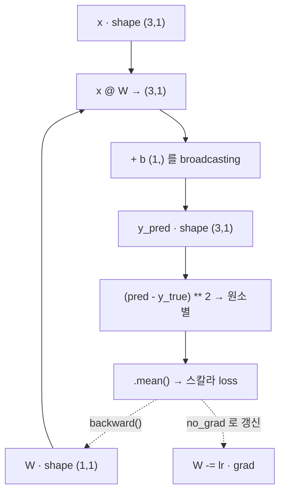

# 01 · Tensor — 데이터를 담는 그릇

> 핵심 질문: 숫자·이미지·가중치를 PyTorch는 하나의 추상체로 어떻게 담고, 어떻게 연산하나?
> 선행: 00장. 소요: 25분.

## 1.1 Tensor란

Tensor는 같은 타입의 숫자들을 격자 형태로 담은 배열에, PyTorch가 두 가지 능력을 더한 거예요.

1. 연산 오버로드 (`+`, `*`, `@`) 와 브로드캐스팅.
2. 기울기 추적 (`requires_grad`) — 02장에서 다룹니다.

`numpy`를 알아도 tensor를 새로 배워야 하는 이유가 바로 2번이에요. 1번은 거의 같으니까, numpy 감각은 그대로 들고 오시면 됩니다.

### 생성

```python
import torch

a = torch.tensor([[1.0, 2.0], [3.0, 4.0]])   # 리스트에서
print("a       =", a.tolist())               # .tolist() 로 파이썬 리스트로
print("a.shape =", tuple(a.shape))
print("a.dtype =", a.dtype)
print("a.device=", a.device)
```

```text
a       = [[1.0, 2.0], [3.0, 4.0]]
a.shape = (2, 2)
a.dtype = torch.float32
a.device= cpu
```

- `shape`(모양): 각 축의 길이예요. 딥러닝 디버깅의 90%는 shape 불일치에서 발생합니다.
- `dtype`: 기본은 `float32`이고, 정수 클래스 레이블은 `long`(=int64)을 씁니다(06장).
- `device`: `cpu` 또는 `cuda`예요. 연산에 쓰는 두 tensor는 device와 dtype이 **같아야** 합니다.

### 채워진 tensor 만들며 크기 감각 익히기

```python
print("ones(2,3).sum() =", torch.ones(2, 3).sum().item())
```

```text
ones(2,3).sum() = 6.0
```

`.item()`은 원소 하나짜리 tensor를 파이썬 스칼라로 빼내는 함수예요. 학습 중에 loss를 출력할 때 필수로 등장합니다.

## 1.2 원소별 연산 vs 행렬 곱

가장 자주 헷갈리는 지점이라 먼저 짚고 갈게요. `*`와 `@`는 완전히 다른 연산입니다.

```python
a = torch.tensor([[1.0, 2.0], [3.0, 4.0]])
print("a @ a =", (a @ a).tolist())     # 행렬 곱 (matmul)
print("a * a =", (a * a).tolist())     # 원소별 곱 (elementwise)
print("a.mean() =", a.mean().item())   # 전체 평균
```

```text
a @ a = [[7.0, 10.0], [15.0, 22.0]]
a * a = [[1.0, 4.0], [9.0, 16.0]]
a.mean() = 2.5
```

- `a @ a`: 선형대수의 그 행렬곱이에요. `(1·1+2·3, 1·2+2·4 / 3·1+4·3, 3·2+4·4)` 이렇게 계산합니다.
- `a * a`: 위치별 제곱이에요. 03장의 손실 `(pred - y)**2`가 여기서 나와요.
- `a.mean()`: 스칼라 손실을 만들 때 쓰는 평균이고요.

### shape 규칙 (선형대수 복습 겸)

규칙은 `(n, m) @ (m, k) → (n, k)` 하나예요. 내측 `m`끼리 맞아야 하고, 결과에는 외측만 남습니다. 이거 하나만 종이에 적어두면 신경망 코드의 shape 추적이 한결 쉬워져요.

<!-- diagrams:inserted -->

원본 예제의 shape이 어떻게 굴러가는지, 종이에 그리듯 옮겨봤습니다. 1.2의 규칙이 바로 붙으실 거예요.



## 1.3 Broadcasting — 서로 다른 모양도 더한다

두 tensor의 shape이 완전히 일치하지 않아도 연산이 됩니다. 크기가 `1`인 축을 자동으로 늘려주거든요. 본인은 안 늘렸다고 하지만요.

```python
x = torch.tensor([[1.0, 2.0], [3.0, 4.0]])   # (2, 2)
bias_col = torch.tensor([[10.0], [20.0]])     # (2, 1)  ← 세로 bias
print("x + bias_col =", (x + bias_col).tolist())
```

```text
x + bias_col = [[11.0, 12.0], [23.0, 24.0]]
```

`(2,2)` tensor에 `(2,1)`을 더하면 `(2,1)`의 각 값이 오른쪽으로 복제되어 해당 행에 더해져요. 1행엔 10이, 2행엔 20이 각각 두 칸에 퍼지는 식이죠. 이게 바로 `y = x @ W + b` 의 `b`(bias)가 batch 방향으로 작동하는 원리입니다. 04장에서 `nn.Linear`이 내부적으로 정확히 이 일을 해요.

## 1.4 reshape / transpose — 데이터 모양 바꾸기

```python
t = torch.arange(12)
print("reshape(3,4)  =", t.reshape(3, 4).tolist())
print("transpose .T  =", t.reshape(3, 4).T.tolist())
print("float() dtype =", t.float().dtype)
```

```text
reshape(3,4)  = [[0, 1, 2, 3], [4, 5, 6, 7], [8, 9, 10, 11]]
transpose .T  = [[0, 4, 8], [1, 5, 9], [2, 6, 10], [3, 7, 11]]
float() dtype = torch.float32
```

- `arange(12)`는 기본 dtype이 `int64`예요. 신경망에 넣으려면 `float()`로 바꿔야 하고요. dtype 캐스팅 실수는 정말 흔합니다.
- `.reshape(-1, 784)`처럼 `-1`을 쓰면 나머지 축을 자동으로 계산해요. 06장 CNN에서 이미지를 1차원으로 펼칠 때 씁니다.

## 1.5 원본 예제 관점에서

`simple_classifier.py`로 돌아가 보면, 첫 세 줄이 모두 tensor 생성이에요.

```python
W = torch.tensor([[2.0]], requires_grad=True)   # 학습할 가중치 (shape 1x1)
b = torch.tensor([1.0],  requires_grad=True)    # bias
x = torch.tensor([[1.0], [2.0], [3.0]])         # 입력 (3 samples × 1 feature)
```

`x`가 `(3,1)`, `W`가 `(1,1)`이므로 `x @ W`는 `(3,1)`이 되고, `b`(shape `(1,)`)는 broadcast 되어 각 행에 더해집니다. shape을 이렇게 손으로 추적하는 습관이 01장의 진짜 목표예요.

## 정리

| 개념 | 코드 | 기억 |
|------|------|------|
| 생성 | `torch.tensor([[..]])` | list → tensor |
| 모양/타입 | `.shape`, `.dtype`, `.device` | 연산은 shape·dtype·device 일치 필요 |
| 원소별 곱 | `a * b` | 위치별 |
| 행렬곱 | `a @ b` | `(n,m)@(m,k)->(n,k)` |
| 평균/스칼라 | `.mean()`, `.item()` | loss 출력용 |
| 크기 자동복제 | broadcasting | bias 더하기의 원리 |
| 모양변환 | `reshape`, `.T`, `float()` | `-1` 자동 축 |

Tensor는 "연산 가능한 숫자 격자"예요. 모델이 데이터를 통과하는 동안 shape이 어떻게 변하는지 종이 위에 그릴 수만 있다면, 딥러닝 코드의 대부분은 예측 가능해집니다.

## 직접 해보기

1. `torch.rand(4, 3)` 으로 4×3 난수 tensor를 만들고, `.mean(dim=0)`으로 열별 평균을 구해보세요. 결과는 몇 개의 숫자입니까?
2. `(2,3)` tensor와 `(3,)` tensor를 `@`로 곱하면 무엇이 일어나나요? 에러라면 왜 에러이고, 고치려면 어떻게 해야 하나요?
3. `x = torch.arange(6).reshape(2,3)` 의 모든 원소를 100으로 만드는 식을 두 가지(브로드캐스트, 명시적 `*`)로 써보세요.

다음: 이 tensor에 "기울기 추적"을 붙여 학습을 가능하게 만드는 [02. Autograd](02_autograd.md).
