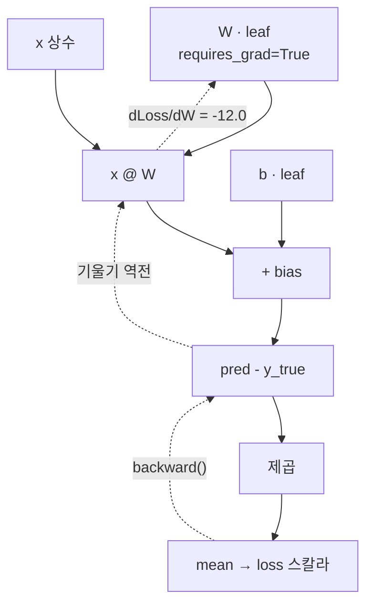

# 02 · Autograd — 기울기의 자동화

> 핵심 질문: PyTorch는 어떻게 `y = x² + 2x`의 미분값을 손으로 안 쓰고 얻는가?
> 선행: 01장. 소요: 25분.

## 2.1 `requires_grad`가 스위치다

01장에서 본 tensor 기억나세요? 여기에 `requires_grad=True`를 켜면 스위치가 올라갑니다.
그 순간부터 이 tensor에서 파생된 계산이 전부 기록되거든요.
기록해뒀으니 뒤에서 되물을 수도 있고요. "이 출력에 대해 내 입력의 기울기는 얼마?"

바로 해볼게요.

```python
import torch

x = torch.tensor(3.0, requires_grad=True)
y = x ** 2 + 2 * x        # y = x² + 2x
y.backward()              # y에 대한 모든 리프의 기울기 계산
print("dy/dx at x=3 (2x+2) =", x.grad.item())
```

```text
dy/dx at x=3 (2x+2) = 8.0
```

손으로 검산해보죠. 미분하면 `dy/dx = 2x + 2`이고, `x=3`을 넣으면 `8`. 출력과 정확히 일치합니다.
`backward()`가 한 일은 이 chain rule을 자동 적용한 것뿐이에요. 그게 전부예요.

## 2.2 계산 그래프와 `.grad`의 생애

여기서 규약은 사실 별거 아닙니다.

- `x`처럼 손으로 직접 만든 tensor를 **leaf**라고 하고, `.grad`는 여기에 채워집니다.
- `y`처럼 연산에서 파생된 tensor는 `.grad`가 `None`이에요. 리프가 아니라서 굳이 저장 안 하거든요.

`W`가 학습 대상인 작은 예로 확인해볼게요.

```python
w = torch.tensor([[2.0]], requires_grad=True)     # leaf (학습 대상)
x = torch.tensor([[1.0], [2.0], [3.0]])
y_true = torch.tensor([[5.0], [7.0], [9.0]])

pred = x @ w                    # 비리프: .grad 없음
loss = ((pred - y_true) ** 2).mean()
print("loss =", loss.item())

loss.backward()                 # loss → pred → w 로 기울기 역전파
print("dLoss/dW =", w.grad.item())
print("new leaf.grad before backward:",
      torch.tensor(1.0, requires_grad=True).grad)
```

```text
loss = 9.0
dLoss/dW = -12.0
new leaf.grad before backward: None
```

### 이 숫자들을 손으로 검산하기

이 부분이 재미있죠. autograd 없이 `W=2`를 직접 대입해볼게요.

- `pred = x @ W = [2,4,6]`
- `pred - y_true = [2-5, 4-7, 6-9] = [-3,-3,-3]`
- `loss = mean(9,9,9) = 9.0` ✓
- `dLoss/dW = mean(2·(pred−y_true)·x) = mean(2·(−3)·[1,2,3]) = mean(−6,−12,−18) = −12.0` ✓

이 네 줄을 손으로 따라 해보면, 이 절은 이미 다 아신 거예요.

`grad`가 음수라는 사실, 눈치채셨나요? 여기서가 핵심입니다. `W`를 늘려야 loss가 줄어든다는 뜻이거든요.
03장의 경사 하강법은 이 정보를 `W ← W − lr·grad` 로 그대로 씁니다.
기울기가 음수이니 마이너스가 뒤집혀 양수 방향으로 이동하고, 결국 `W`가 커지는 구조예요.

여기까지 따라오셨으면 반은 성공이에요. 진짜예요. 다만 `.grad`를 다루는 함정이 두 개 남아 있어서,
그건 지나가면서 한번씩 당겨볼게요.

<!-- diagrams:inserted -->

2.2의 계산을 그래프로 그려보면 `backward()` 가 왜 "역전파"인지 저절로 보입니다. 실선은 순방향, 점선은 기울기예요. `dLoss/dW = -12.0` 은 위 실행에서 나온 값입니다.



## 2.3 함정 #1: `.grad`는 누적된다

진짜 이야기할게요. 거의 모든 사람이 한 번씩 걸리는 함정입니다.
`backward()`를 매 반복마다 호출하면 `.grad`가 초기화되지 않고 **계속 더해집니다.**
`simple_classifier.py`가 매 루프 끝에서 `W.grad.zero_()`를 명시적으로 호출했던 이유가 이 치우림이었어요.

```python
a = torch.tensor(2.0, requires_grad=True)
for _ in range(3):
    (a ** 2).backward()          # 안 지우고 계속 backward
print("누적된 grad (초기화 없음):", a.grad.item())   # 4+4+4 = 12
```

```text
누적된 grad (초기화 없음): 12.0
```

한 번만 계산했다면 `grad = 2a = 4`가 정답인데, 치우지 않고 3번 누적돼 12가 됐습니다.
기울기가 이만큼 불어났으니 걸음 크기가 망가지는 것도 시간문제겠죠.
학습 루프에서 `zero_grad()`를 빠뜨리면 기울기가 부풀어 올라 **발산합니다.** 03장에서 다시 등장해요.

## 2.4 함정 #2: `no_grad()` — 갱신 자체를 추적 금지하기

두 번째 함정은 반대 방향이에요. 가중치를 직접 갱신할 때(`W -= lr*W.grad`),
그 갱신 연산조차 그래프에 기록되면 안 됩니다. 장부를 깔끔하게 유지하는 문제가거든요.
그래서 `with torch.no_grad():` 블록 안에서 갱신합니다. "이 구간은 기록하지 마"라고 선언하는 거죠.

```python
w = torch.tensor(5.0, requires_grad=True)
with torch.no_grad():
    w -= 1.0                     # 추적을 피해서 값만 변경
print("no_grad 안에서 갱신 후 w =", w.item())
```

```text
no_grad 안에서 갱신 후 w = 4.0
```

> `no_grad()` 없이 `w -= 1.0`을 하면 PyTorch가 "운영체제가 inplace 연산을 추적된 tensor에
> 하려 한다"며 에러를 냅니다. **추적 중인 tensor의 값을 바꾸는 모든 자리(학습 갱신, 추론)에
> `no_grad()`가 필요**하다는 습관을 붙이세요. 04장 `nn` API는 이걸 내부에서 알아서 해줍니다.

## 2.5 원본 예제와 연결

이제 `simple_classifier.py`의 학습 루프를 autograd 안경으로 다시 읽어볼게요.
이 장에서 배운 것이 한 화면에 다 들어옵니다.

```python
for _ in range(100):
    y_pred = x @ W + b          # forward: 이 결과가 목표와 얼마나 다른가
    loss = ((y_pred - y_true) ** 2).mean()   # 스칼라 손실
    loss.backward()             # ← dLoss/dW, dLoss/db 계산 (이 장)
    with torch.no_grad():       # ← 갱신은 추적 외 (2.4)
        W -= 0.01 * W.grad      # ← 경사 하강법 (03장)
        b -= 0.01 * b.grad
        W.grad.zero_()          # ← 누적 방지 (2.3)
        b.grad.zero_()
```

속이 후련하시죠? 이 루프가 **딥러닝 학습의 전부**입니다. 규모가 커져도(05, 06장) 이 다섯 단계는 그대로예요.
03장은 가운데 두 단계(손실 정의와 갱신 규칙)를 갈라서 다루고, 04장은 이 전체를 `nn`/`optim`이
대신하게 만드는 법을 다룹니다.

## 정리

| 개념 | 포인트 |
|------|--------|
| `requires_grad=True` | 이 tensor부터 계산을 기록하라 |
| `loss.backward()` | 리프 `.grad`에 기울기 채움 (chain rule 자동) |
| leaf vs 비리프 | `.grad`는 leaf에만 채워짐 |
| 기울기 부호 | `grad` 음수 → 값을 키우면 loss 감소 |
| `.grad` 누적 | 매 반복 `zero_grad()` 필수 |
| `no_grad()` | 갱신·추론 연산은 그래프에 남기지 말 것 |

## 직접 해보기

1. `y = x**3` 에 대해 `x=2` 일 때 `.grad`는? 손으로 계산한 `3x²`과 맞는지 확인.
2. 2.3 코드의 루프 안에서 `a.grad.zero_()`를 추가하면 최종 `grad`가 어떻게 변하는지 실험해 보세요.
3. `z = x*y + y**2` (x, y 모두 `requires_grad=True`)에서 `z.backward()` 후 `x.grad`, `y.grad`를
   손으로 구한 편미분(`∂z/∂x = y`, `∂z/∂y = x + 2y`)과 비교.

다음: 이렇게 얻은 기울기를 **어떻게 값 갱신에 쓰는가** — [03. Loss와 Optimizer](03_loss_optimizer.md).
