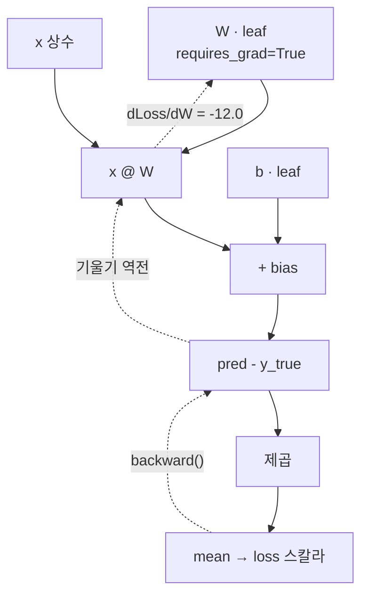

# 02 · Autograd — COMPUTER가 "얼마나 틀렸는지"를 대신 계산해주는 이야기

> 오늘 이야기: 숫자를 조금만 움직이면 정답에 더 가까워질까요?
> 이걸 컴퓨터가 **스스로** 알아내게 만드는 방법이 오늘 내용이에요.
> 선행: 01장. 소요: 25분.

## 2.0 시작하기 전에 — "기울기"가 뭔지부터

기울기는 **언덕의 가파르기**예요.

- 미끄럼틀을 딱 하나만 상상해보세요.
- 가파르면(기울기가 크면) 한 발만 움직여도 높이가 확 바뀌어요.
- 완만하면(기울기가 작으면) 아무리 걸어도 별로 안 변하고요.

숫자로 말하면 이렇게 생겼습니다. `y = x² + 2x` 에서 `x=3`일 때,
`x`를 **조금만** 키우면 `y`가 얼마나 커지나요? 그 "얼마나"가 바로 기울기예요.

수학 시간에 배운 미분을 쓰면 답이 바로 나옵니다. `2x + 2` 에 `3`을 넣으면 `8`.
**문제는 진짜 미분 어려운 큰 모델에서는 이렇게 손으로 못 푼다**는 거예요.
그래서 컴퓨터에게 시킵니다. 컴퓨터 이름이 바로 `autograd`(자동으로 기울기를 계산해주는 기능)예요.

## 2.1 `requires_grad` = "이 상자에는 카메라를 켜자"

01장에서 본 tensor(숫자 상자) 기억나세요?
여기에 `requires_grad=True` 를 붙이면 **카메라가 켜집니다**.

그러면 그 상자에서 나온 계산이 **모두 녹화**돼요.
녹화해놨으니까 나중에 거꾸로 되물을 수 있습니다.
"방금 그 결과 나오게 만든 건 누구니? 너는 얼마나 기여했니?" 라고요.

바로 해볼게요.

```python
import torch

x = torch.tensor(3.0, requires_grad=True)
y = x ** 2 + 2 * x        # y = x² + 2x
y.backward()              # y에 대한 모든 리프의 기울기 계산
print("dy/dx at x=3 (2x+2) =", x.grad.item())
```

```text
dy/dx at x=3 (2x+2) = 8.0
```

`backward()` 이 "거꾸로 따져봐" 라는 명령이에요.
그랬더니 `8.0` 이 나왔죠. 손으로 계산한 미분(`2x + 2 = 8`)과 **딱 맞습니다**.

즉 `backward()`가 한 일은 대단한 게 아니라,
수학 시간에 배운 **chain rule을 컴퓨터가 대신 적용한 것**뿐이에요. 그게 전부예요.

### 잠깐, 그럼 이건 왜 필요한가요?

왜냐하면 실제 모델에서는 `x`가 백만 개이고 계산도 수십 단계라서,
사람이 `2x + 2` 를 손으로 만들 수가 **없거든요.**
그래서 "나는 계산식만 짜줄게, 누가 얼마나 틀렸는지는 네가 알아내" 라고 컴퓨터에게 넘기는 겁니다.

## 2.2 계산 그래프 — 누가 누구에게 영향을 줬는지 그리는 그림

이제 규칙 두 개만 외우면 돼요. 사실 외울 것도 없습니다.

- `x`처럼 **내가 직접 만든** 상자를 **leaf(잎)** 라고 불러요. 점수표(`.grad`)는 잎에만 붙습니다.
- `y`처럼 **계산해서 생긴** 상자는 점수표가 `None`(없음)이에요. 그냥 중간 결과물이라서요.

이름을 외우려 하지 말고 그림을 보세요. `W`가 학습 대상인 아주 작은 예로 확인합니다.

```python
w = torch.tensor([[2.0]], requires_grad=True)     # leaf (학습 대상)
x = torch.tensor([[1.0], [2.0], [3.0]])
y_true = torch.tensor([[5.0], [7.0], [9.0]])

pred = x @ w                    # 비리프: .grad 없음
loss = ((pred - y_true) ** 2).mean()
print("loss =", loss.item())

loss.backward()                 # loss → pred → w 로 기울기 역전파
print("dLoss/dW =", w.grad.item())
print("new leaf.grad before backward:",
      torch.tensor(1.0, requires_grad=True).grad)
```

```text
loss = 9.0
dLoss/dW = -12.0
new leaf.grad before backward: None
```

### 이 숫자들을 손으로 따라가보기 (진짜 재미있는 부분)

컴퓨터가 뭘 계산했는지 우리가 직접 해볼게요. `W = 2` 를 넣은 상태에서 시작합니다.

1. `pred = x @ W = [2,4,6]` — `1×2`, `2×2`, `3×2` 이니까요.
2. `pred - y_true = [2-5, 4-7, 6-9] = [-3,-3,-3]` — 세 개 다 **3씩 작게** 예측했네요.
3. `loss = mean(9,9,9) = 9.0` ✓ — 틀린 걸 제곱해서 평균 냈어요. 이 점수가 **틀린 정도**입니다.
4. `dLoss/dW = mean(2·(pred−y_true)·x) = mean(2·(−3)·[1,2,3]) = mean(−6,−12,−18) = −12.0` ✓

네 줄을 이렇게 손으로 따라 하면, 이 절은 이미 끝난 거예요.

### 마이너스가 나왔다는 게 핵심입니다

`dLoss/dW = -12.0` 에서 **minus(음수)** 인 걸 눈치채셨나요? 여기가 오늘 이야기의 알짜예요.

- 기울기가 **음수** = "`W`를 **키우면** 틀린 점수가 **줄어든다**" 는 뜻입니다.
- 그러니까 우리는 `W`를 키우러 갈 거예요.

03장에서 만날 방법이 바로 이겁니다: `W ← W − lr·grad`.
기울기가 음수인데 마이너스를 한 번 더 붙이니, 결국 `W`가 **커지는** 구조예요.
"틀린 쪽으로 더 갔으니 반대쪽으로 가자" 를 식으로 쓴 것뿐이랍니다.

여기까지 따라오셨으면 반은 성공이에요. 진짜예요.
다만 `.grad`를 다룰 때 함정이 **두 개** 더 남아 있습니다. 지나가면서 한 번씩 걸려볼게요.

<!-- diagrams:inserted -->

2.2의 계산을 그림으로 그리면 `backward()` 가 왜 "역전파(거꾸로 퍼져감)"인지 저절로 보여요.
실선은 앞으로 가는 계산, 점선은 거꾸로 돌아가는 기울기입니다. `dLoss/dW = -12.0` 은 위 실행에서 나온 값이에요.



## 2.3 함정 #1: `.grad`는 지우개를 안 쓰면 계속 더해진다

이제 진짜 이야기할게요. 거의 모든 사람이 한 번씩 걸리는 함정입니다.

`backward()`를 반복문 안에서 계속 부르면 `.grad`가 **초기화되지 않고 자꾸 더해집니다.**
매일 노트에 더셈을 하는데 절대 지우개로 지우지 않는다고 생각해 보세요. 하루가 지나면 숫자가 이상해지겠죠?

```python
a = torch.tensor(2.0, requires_grad=True)
for _ in range(3):
    (a ** 2).backward()          # 안 지우고 계속 backward
print("누적된 grad (초기화 없음):", a.grad.item())   # 4+4+4 = 12
```

```text
누적된 grad (초기화 없음): 12.0
```

한 번만 계산했다면 `grad = 2a = 4`가 정답이에요. 그런데 치우지 않고 3번 쌓아서 12가 됐습니다.

기울기가 이만큼 부풀어 오르면 걸음 크기가 망가지는 건 시간문제겠죠.
그래서 학습할 때마다 반드시 `W.grad.zero_()` 로 **지우개를 칩니다.**
이걸 빼먹으면 기울기가 자라서 **발산**(멀리멀리 튕겨나감)해요. 03장에서 다시 만나요.

## 2.4 함정 #2: `no_grad()` = "지금은 녹화 끄고 그냥 값만 바꾸자"

두 번째 함정은 반대 방향이에요.

`W -= lr*W.grad` 로 값을 고칠 때, **그 고치는 행동까지 녹화되면 곤란합니다.**
우리가 나중에 되물어야 할 건 "왜 틀렸나" 이지, "점을 어떻게 고쳤나"가 아니거든요.
장부에 안 쓸 걸까지 잔뜩 쌓이는 셈이고요.

그래서 이 구간은 카메라를 끕니다. `with torch.no_grad():` 가 그 스위치예요.

```python
w = torch.tensor(5.0, requires_grad=True)
with torch.no_grad():
    w -= 1.0                     # 추적을 피해서 값만 변경
print("no_grad 안에서 갱신 후 w =", w.item())
```

```text
no_grad 안에서 갱신 후 w = 4.0
```

> `no_grad()` 없이 `w -= 1.0` 을 하면 PyTorch가 "운영체제가 inplace 연산을 추적된 tensor에
> 하려 한다"며 에러를 냅니다. **추적 중인 tensor의 값을 바꾸는 모든 자리(학습 갱신, 추론)에
> `no_grad()`가 필요**하다는 습관을 붙이세요. 04장 `nn` API는 이걸 내부에서 알아서 해줍니다.

## 2.5 그러면 처음 그 코드는 뭐였나요?

자, 01장부터 데려온 `simple_classifier.py` 학습 루프를 오늘 배운 안경으로 다시 봐요.
이 장에서 나온 단어가 **한 화면에 전부** 들어 있습니다.

```python
for _ in range(100):
    y_pred = x @ W + b          # forward: 이 결과가 목표와 얼마나 다른가
    loss = ((y_pred - y_true) ** 2).mean()   # 스칼라 손실
    loss.backward()             # ← dLoss/dW, dLoss/db 계산 (이 장)
    with torch.no_grad():       # ← 갱신은 추적 외 (2.4)
        W -= 0.01 * W.grad      # ← 경사 하강법 (03장)
        b -= 0.01 * b.grad
        W.grad.zero_()          # ← 누적 방지 (2.3)
        b.grad.zero_()
```

속이 후련하시죠? 이 루프가 **딥러닝 학습의 전부**입니다.
모델이 아무리 커져도(05장, 06장) 이 다섯 단계는 그대로예요.

- 03장은 이 가운데 "틀린 정도 구하기"와 "걸음 크기 정하기"를 따로 떼서 자세히 다룹니다.
- 04장은 이 전체를 `nn`/`optim` 이 대신하게 만들어 코드를 8줄로 줄이는 법을 다룹니다.

## 오늘의 단어장

| 어려운 말 | 사실은 이 뜻이에요 |
|-----------|-------------------|
| tensor | 숫자를 가지런히 담아둔 상자 |
| `requires_grad=True` | "이 상자부터 계산 녹화하자" 는 카메라 스위치 |
| leaf(잎) | 내가 직접 만든 상자. 점수표(`.grad`)는 이것만 가진다 |
| forward | 앞으로 계산해서 예측 만들어보기 |
| loss | "얼마나 틀렸니" 를 점수 하나로 줄인 것 |
| `backward()` | 틀린 원인을 거꾸로 캐내는 버튼 |
| gradient (`grad`) | "여기를 이만큼 움직이면 좋아져" 라는 화살표 |
| `zero_grad()` | 노트를 지우개로 지우기. 안 하면 계속 더해진다 |
| `no_grad()` | 녹화 끄기. 값을 고칠 때는 이게 필요해요 |
| 발산 | 걸음이 너무 커서 점점 엉뚱한 데로 튕겨나가는 것 |

## 정리

이 장은 아래 여섯 줄로 끝납니다.

| 개념 | 포인트 |
|------|--------|
| `requires_grad=True` | 이 tensor부터 계산을 기록하라 |
| `loss.backward()` | 리프 `.grad`에 기울기 채움 (chain rule 자동) |
| leaf vs 비리프 | `.grad`는 leaf에만 채워짐 |
| 기울기 부호 | `grad` 음수 → 값을 키우면 loss 감소 |
| `.grad` 누적 | 매 반복 `zero_grad()` 필수 |
| `no_grad()` | 갱신·추론 연산은 그래프에 남기지 말 것 |

## 직접 해보기

쉬운 것부터 하나씩요.

1. `y = x**3` 에 대해 `x=2` 일 때 `.grad`는 몇인가요? 손으로 계산한 `3x²`과 맞는지 확인해보세요.
2. 2.3 코드에서 `a.grad.zero_()` 를 한 줄 추가하면 최종 `grad`가 어떻게 변할까요? 직접 쳐서 확인해보세요.
3. (도전) `z = x*y + y**2` (x, y 모두 `requires_grad=True`)에서 `z.backward()` 후 `x.grad`, `y.grad`를
   손으로 구한 편미분(`∂z/∂x = y`, `∂z/∂y = x + 2y`)과 비교해보세요. 어려우면 1번, 2번만 해도 충분해요.

다음: 이렇게 얻은 화살표(`grad`)를 **실제로 값 고치는 데 어떻게 쓰는지** — [03. Loss와 Optimizer](03_loss_optimizer.md).
