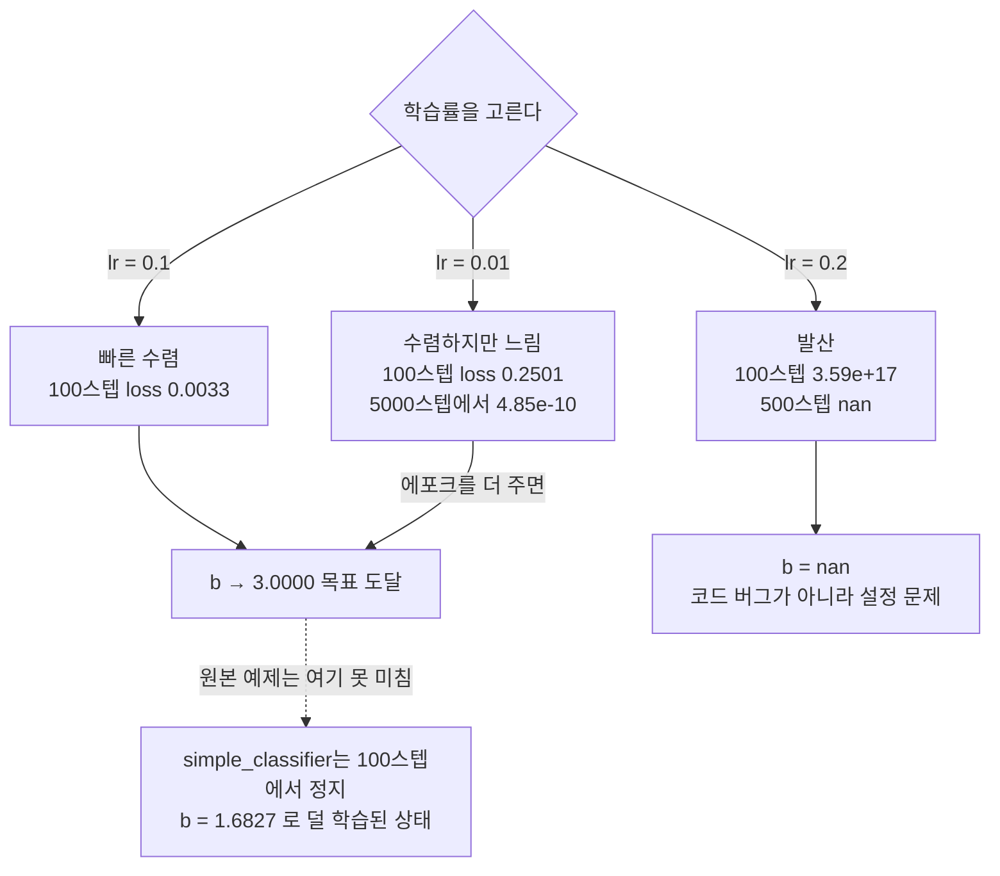

# 03 · Loss와 Optimizer — 학습의 두 바퀴

> 핵심 질문: "얼마나 틀렸나"(loss)와 "어떻게 고치나"(optimizer)를 분리해서 이해한다.
> 그리고 **학습률을 잘못 고르면 발산한다**는 것을 실측으로 경험한다.
> 선행: 02장. 소요: 30분. 이 책의 심장.

## 3.1 Loss function — 틀린 정도를 하나의 숫자로

학습을 시작하려면 "지금 모델이 얼마나 틀렸는지"를 스칼라 하나로 줄여야 해요.
점수가 없으면 오늘이 어제보다 나은지 비교할 방법이 없거든요. 그게 loss입니다.

이 책 전체가 쓰는 예제 데이터는 `y = 2x + 3`이에요. `x=[1,2,3] → y=[5,7,9]`이고,
모델은 `ŷ = Wx + b`로 이걸 흉내 내려 합니다.

### 평균 제곱 오차 (MSE)

```python
import torch

x = torch.tensor([[1.0], [2.0], [3.0]])
y_true = torch.tensor([[5.0], [7.0], [9.0]])
W, b = 2.0, 1.0                      # 초기값 (예제의 시작 상태)
y_pred = x * W + b
loss = ((y_pred - y_true) ** 2).mean()
print("y_pred =", y_pred.flatten().tolist())
print("MSE    =", loss.item())
```

```text
y_pred = [3.0, 5.0, 7.0]
MSE    = 4.0
```

숫자를 읽어볼게요. `ŷ=[3,5,7]`과 `y=[5,7,9]`, 세 칸이 모두 딱 2씩 작습니다. 그래서 `(−2)² 평균 = 4`.
매번 2씩 모자란 이유는 `b`가 3이어야 하는데 1이기 때문이에요. 완전히 틀린 게 아니라 **일정하게 낮은** 상황이죠.
목표는 `loss → 0`입니다.

> **왜 MSE?** 회귀(숫자 예측)의 기본 손실. 큰 오차에 제곱으로 민감하게 반응합니다.
> 분류는 05~06장의 **CrossEntropy**를 씁니다. "무엇을 예측하느냐"가 손실을 정합니다.

## 3.2 Optimizer — 기울기를 값으로 번역하는 규칙

다음은 "어떻게 고치나"예요. 경사 하강법은 사실 업데이트 규칙 하나뿐입니다.

```
W ← W − learning_rate · (dLoss/dW)
```

- `dLoss/dW`는 02장의 `W.grad`예요. 어느 방향으로 얼마나 틀렸는지를 말하죠.
- `learning_rate`(lr, 학습률)은 그 방향으로 얼마큼 움직일 것인가를 말해요.

lr이 너무 작으면 느려서 답답하고, 너무 크면 overshoot해서 오히려 발산합니다.
이게 이 장의 핵심 실험이에요. 지금 실측으로 붙잡아볼게요.

## 3.3 실험 — 학습률이 수렴을 결정한다

시작 전에 하나 짚고 갈게요. 이 실측엔 난수가 없어서 `torch.manual_seed`는 불필요합니다.
아래는 `simple_classifier.py`와 **동일한 손 코딩 루프**를 lr만 바꿔 10,000 스텝 돌린 실측이에요.

```python
import torch

x = torch.tensor([[1.0], [2.0], [3.0]])
y_true = torch.tensor([[5.0], [7.0], [9.0]])

def run(steps, lr):
    W = torch.tensor([[2.0]], requires_grad=True)
    b = torch.tensor([1.0], requires_grad=True)
    for _ in range(steps):
        loss = ((x @ W + b - y_true) ** 2).mean()
        loss.backward()
        with torch.no_grad():
            W -= lr * W.grad
            b -= lr * b.grad
            W.grad.zero_(); b.grad.zero_()
    return W.item(), b.item(), loss.item()

for lr in (0.01, 0.1, 0.2):
    W, b, loss = run(10000, lr)
    print(f"lr={lr}: W={W:.4f} b={b:.4f} loss={loss:.3e}")
```

실측 결과:

```text
lr=0.01: W=2.0000 b=2.9999 loss=4.848e-10
lr=0.1:  W=2.0000 b=3.0000 loss=1.592e-12
lr=0.2:  W=nan    b=nan    loss=nan
```

세 줄을 위에서 아래로 읽어볼게요. 해석은 이렇습니다.

- `lr=0.01`은 수렴합니다. 다만 느려요. 10,000 스텝은 필요하거든요.
- `lr=0.1`은 같은 데이터에서 100배 더 빨리 수렴해요. 이 문제가 좋은 학습률입니다.
- `lr=0.2`는 발산입니다. 매 스텝마다 오차가 커지다가, 결국 `nan`(숫자가 아님)으로 붕괴해요.

같은 loss, 같은 기울기인데 걸음 크기 하나가 수렴과 붕괴를 가릅니다.
이게 "optimizer를 고른다"는 것의 실체예요. 곱씹을수록 우습지 않나요?
근데 자기 화면에서 벌어지면 하나도 안 웃을 거예요.

### 왜 lr=0.2가 터지는가 (손으로 보는 stability)

왜 터지는지까지 보면 사실 어렵지 않아요. MSE 손실에서 이 문제의 기울기는 거의 선형이라,
경사 하강법은 `W`에 대해 비율 `1 − 2·lr·E[x²]`만큼 오차가 매 스텝 곱해지며 줄어드는 구조입니다.
여기에 `E[x²]=(1+4+9)/3=4.667`이고요. 이제 대입만 남았어요.

- 감소율 ≈ `1 − 2·lr·4.667 = 1 − 9.33·lr` 가 됩니다.
- `lr=0.1`이면 `1 − 0.933 = 0.067`. 0에 빠르게 접근하니 잘 수렴하는 거죠 ✓
- `lr=0.2`이면 `1 − 1.867 = −0.867`. 절댓값이 1에 가까운 데다 부호가 매 스텝 흔들려서, 진동이 커지다 **발산**합니다 ✓
- 안정 조건은 `|1 − 9.33·lr| < 1`, 즉 `lr < 0.214`예요. `0.2`는 이 경계에 아슬아슬하게 걸려서 터집니다.

> 이 "lr 상한" 감각이 큰 네트워크에서 더 중요해집니다. 그래디언트 폭발/소실도 같은 계열 문제입니다.

<!-- diagrams:inserted -->

lr이 수렴과 붕괴를 가르는 장면입니다. 아래 값은 전부 3.3의 실측이에요. 안정 조건 `|1 - 9.33·lr| < 1` 에서 경계인 `lr < 0.214` 를 넘은 순간 세 번째가 터집니다.



## 3.4 같은 lr, 다른 스텝 수 — 원본 예제 재평가

이쯤 오면 원본 예제 이야기를 안 할 수가 없어요. `simple_classifier.py`는 `lr=0.01`로 겨우 100 스텝만
돕니다. 3.3의 곡선을 스텝별로 펴보면 이 예제가 어디에 서 있는지 드러나죠.

```text
lr=0.01 손실 곡선 (실측):
 step     1  loss 4.000000e+00
 step    10  loss 8.190783e-01
 step   100  loss 2.501273e-01   ← 원본 예제가 여기에서 멈춤
 step   500  loss 3.647096e-02
 step  1000  loss 3.286063e-03
 step  5000  loss 4.848364e-10   (수렴)
```

100 스텝에서 loss는 아직 `0.25`예요. 이때의 `W,b`가 바로 원본 예제가 뱉은 **`2.5795, 1.6827`** 입니다.
`b=1.68`은 목표 3에 못 미치죠. 그러면 오답일까요? 아녜요.
오답이 아니라, 덜 학습된 상태일 뿐입니다.

그래서 교훈을 남깁니다. 학습이 안 된 것처럼 보이는 대다수 원인은 bug가 아니라
**에포크 부족 + 학습률 과소**예요. `for _ in range(100)` 을 `range(1000)`으로 바꾸거나
lr을 `0.1`로 올리면, 같은 코드가 예쁘게 수렴합니다.

## 3.5 Optimizer의 확장 — SGD와 Adam

여기서 슬쩍 눈치채신 분도 계실 거예요. 그동안 손으로 쓰던 그 줄이 뭔지 아세요?
손 코딩한 `W -= lr*W.grad`가 바로 SGD(확률적 경사 하강법)의 가장 단순한 형태예요.
PyTorch는 같은 규칙을 `torch.optim`으로 감싸주기만 합니다.

```python
W = torch.tensor([[2.0]], requires_grad=True)
opt = torch.optim.SGD([W], lr=0.1)     # 파라미터 목록 + lr
# 매 스텝:
opt.zero_grad()      # 2.3의 zero_grad()를 대신
# ... loss 계산, loss.backward() ...
opt.step()           # 3.2의 "W -= lr*W.grad"를 대신
```

| Optimizer | 한 줄 설명 | 언제 |
|-----------|-----------|------|
| SGD | `W -= lr·grad`. lr 민감 | 기본, 모멘텀 추가 가능 |
| SGD(momentum) | 이전 방향을 관성으로 반영 | SGD보다 덜 진동 |
| Adam | 파라미터별 자동 lr 스케일 | 기본값으로 강력, 튜닝 부담 ↓ |

> **결론**: lr=0.2 발산은 SGD만의 문제입니다. Adam(05, 06장에서 사용)은 걸음크기를 자동 조절해
> 같은 데이터에서 훨씬 넓은 lr 범위를 견딥니다. "optimizer를 고른다"는 건 곧 **수렴 속도와
> 튜닝 난이도를 고르는 것**입니다.

## 정리

1. **Loss** = 틀린 정도를 스칼라로. 회귀는 MSE, 분류는 CrossEntropy.
2. **Optimizer** = `W ← W − lr·grad` 를 규칙화한 것. lr이 핵심 하이퍼파라미터.
3. lr은 수렴 속도와 **발산 여부**를 결정한다 (실측: 0.1 수렴 / 0.2 발산).
4. "안 되는 모델"의 절반은 lr·에포크 부족이다. 원본 예제가 대표 사례.
5. 손 코딩(SGD)을 이해하면 `torch.optim`이 무엇을 대신하는지 안다.

## 직접 해보기

아래 `book/code/ch03_learning_rate_lab.py`를 열어 직접 해보세요:
1. lr을 0.05로 바꿔 스텝 100에서 loss를 측정해 보세요. 3.4 곡선의 어디쯤인가요?
2. `lr=0.21`로 1000 스텝 돌리면? (3.3의 안정 조건 경계 근처를 직접 확인)
3. 원본 `simple_classifier.py`의 `range(100)`을 손대지 말고 `lr`만 `0.1`로 바꿔 실행 → `b`가 3에 가까워지는지 관찰.

다음: 이 손 코딩 전체를 PyTorch의 `nn`/`optim` API로 8줄로 줄이는 [04장](04_first_model.md).
