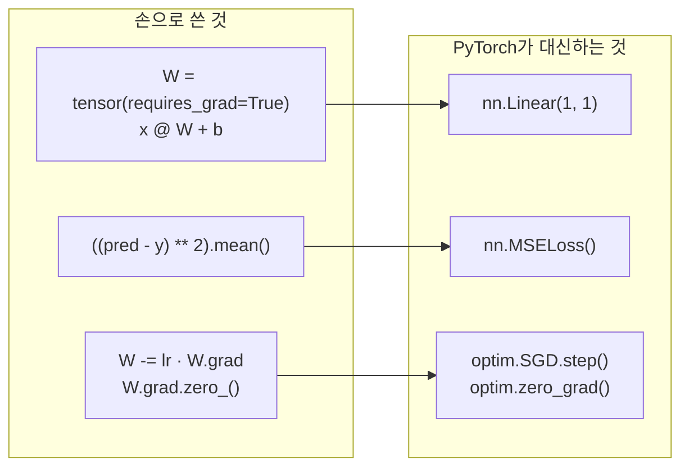

# 04 · 첫 모델 — `nn.Module`으로 다시 쓰기

> 핵심 질문: 03장에서 손으로 쓴 20줄 학습 루프를 PyTorch가 얼마나 대신해주는가?
> 선행: 02, 03장. 소요: 25분.

## 4.1 손 코딩의 3단계 이관

PyTorch는 02~03장의 수작업을 세 가지 추상으로 묶어두었어요. 우리가 할 일은 그냥 넘겨주는 것뿐이죠.

| 손으로 한 것 | PyTorch가 대신 | 왜 |
|--------------|----------------|----|
| `W = tensor(..., requires_grad=True)`, `x @ W + b` | `torch.nn.Linear(1, 1)` | 가중치·bias·연산을 한 객체로 |
| `((pred-y)**2).mean()` | `torch.nn.MSELoss()` | 손실 재사용·수치 안전 |
| `W -= lr*W.grad; W.grad.zero_()` | `torch.optim.SGD(model.parameters(), lr)` | 모든 파라미터 일괄 갱신 |

### `nn.Linear(in, out)` 안에서는 정확히 `x @ W.T + b`

속이 다를 것 같죠? `nn.Linear`은 얼굴만 바꿨지 속은 그대로예요.
`nn.Linear(1,1)`은 `requires_grad=True`인 `weight`(출력×입력)와 `bias`를 만들고
순전파 시 01장의 broadcasting으로 bias를 더합니다.
그러니 03장의 `x @ W + b`와 완전히 동일한 식이죠.

## 4.2 선형 회귀 한 번에 — 원본과 같은 문제

손으로 돌려왔던 그 루프를, 이제 API로 한 번에 세워볼게요. 문제도 데이터도 그대로예요.

```python
import torch

torch.manual_seed(0)
X = torch.tensor([[1.0], [2.0], [3.0]])
Y = torch.tensor([[5.0], [7.0], [9.0]])

model = torch.nn.Linear(1, 1)          # 가중치 1, bias 1 (자동 생성)
criterion = torch.nn.MSELoss()
optimizer = torch.optim.SGD(model.parameters(), lr=0.1)

for epoch in range(200):
    optimizer.zero_grad()              # 2.3 누적이 방지
    out = model(X)                     # forward
    loss = criterion(out, Y)           # 03장 MSE
    loss.backward()                    # 02장 역전파
    optimizer.step()                   # 03장 갱신
    if epoch in (0, 49, 199):
        print(f"epoch {epoch:>3}  loss {loss.item():.6f}")

print("W =", round(model.weight.item(), 4), " b =", round(model.bias.item(), 4))
print("pred(10) =", round(model(torch.tensor([[10.0]])).item(), 3), "(expect 23)")
```

실측:

```text
epoch   0  loss 44.658020
epoch  49  loss 0.023174
epoch 199  loss 0.000016
W = 2.0045  b = 2.9898
pred(10) = 23.035 (expect 23)
```

결과를 볼게요. `W→2, b→3`. 드디어 정답에 도달했습니다.
같은 문제인데 03장 손 코딩은 **10,000스텝**을 요구했고, `optim` + lr=0.1 조합은 200 에포크로 끝내요.
코드가 화려해진 게 아니라 대신 일해주는 손길이 늘어난 차이죠. 그래도 학습 루프의 5단계는 그대로 보입니다:

```
zero_grad() → forward → loss → backward → step
```

이 5줄이 이 장 전체예요. 아니, 사실 모든 PyTorch 학습의 골격이 바로 이것입니다.

<!-- diagrams:inserted -->

02·03장에서 손으로 하던 게 어디로 숨었는지 대응시켜보면 이렇습니다. 오른쪽이 `nn`/`optim` 이 대신하는 부분이에요.



## 4.3 5단계 각각의 책임

```python
optimizer.zero_grad()   # ① 지난 스텝의 .grad 비움 (안 하면 누적, 2.3)
out = model(X)          # ② 현재 파라미터로 예측 (forward)
loss = criterion(out, Y)# ③ 틀린 정도 (스칼라)
loss.backward()         # ④ 모든 파라미터 .grad 채움 (reverse-mode autodiff)
optimizer.step()        # ⑤ .grad로 파라미터 갱신 (no_grad 내부적으로 사용)
```

- ①을 잊으면 03장 `lr=0.2`와 똑같이 발산합니다. `optim`이 이 귀찮음을 대신 처리해요. 저도 이 한 줄 빼먹고
  헤맨 적이 있어서 두 번 말씀드립니다.
- ⑤는 `no_grad()`를 직접 쓸 필요가 없어요. `optimizer.step()`이 내부에서 추적을 끄고 갱신합니다.
  여기는 PyTorch가 정말 잘한 부분이에요.
- `model(X)`는 `model.forward(X)`예요. `nn.Module`이 `__call__`을 오버로드해서 그렇게 보입니다.

## 4.4 원본 `simple_classifier.py`와 최종 비교

| | 원본 | 이 장 |
|---|------|-------|
| 파라미터 선언 | `W=..., b=...` 직접 | `nn.Linear(1,1)` |
| forward | `x @ W + b` | `model(X)` |
| loss | 수식 인라인 | `MSELoss()` |
| 갱신 | `W -= 0.01*W.grad` 직접 | `optimizer.step()` |
| zero_grad | 직접 | `optimizer.zero_grad()` |
| lr | 0.01 (과소) | 0.1 (적정) |
| 스텝 | 100 (부족) | 200 |
| **결과** | **`b=1.68` (미수렴)** | **`b=3.0` (수렴)** |

동일한 문제를 **의도를 드러내는 API**로 다시 쓰니, 덜 학습된 오개에서 벗어납니다.
이 전환의 완전한 스크립트는 `book/code/ch04_first_model.py`에 있어요.

> **왜 원본을 버리지 않고 비교하나**: 손 코딩은 "PyTorch 마법이 무엇을 숨겼는지"를 아는 유일한
> 방법입니다. API에 익숙해진 뒤에도 02~03장의 루프를 손으로 다시 쓸 수 있어야 디버깅이 됩니다.

## 4.5 모델을 객체로 정의하기 — `nn.Module` 서브클래스

`nn.Linear` 하나를 넘어 **층을 직접 조립**하고 싶어지면 `nn.Module`을 상속합니다.
06장 CNN으로 그대로 확장되는 패턴이라, 여기서 익혀두면 나중에 이자까지 붙어요.

```python
import torch

class TwoLayerNet(torch.nn.Module):
    def __init__(self):
        super().__init__()                 # nn.Module 초기화 필수
        self.fc1 = torch.nn.Linear(2, 16)  # 입력 2 → 숨겨진 16
        self.act = torch.nn.ReLU()
        self.fc2 = torch.nn.Linear(16, 3)  # 숨겨진 16 → 출력 3

    def forward(self, x):
        return self.fc2(self.act(self.fc1(x)))

net = TwoLayerNet()
print(net(torch.randn(4, 2)).shape)        # (batch 4, 클래스 3)
print("trainable tensors:",
      sum(p.numel() for p in net.parameters()))
```

```text
torch.Size([4, 3])
trainable tensors: 99
```

- `__init__`에 선언한 하위 `Module`(`fc1`, `fc2`)은 자동으로 `.parameters()`에 잡힙니다.
  → `TwoLayerNet().parameters()`를 `optim`에 넘기면 알아서 학습돼요.
- 파라미터 수 **99** 는 다음 분해입니다. `Linear(in,out)`는 `weight(out,in) + bias(out)`를 가집니다.

  ```text
  fc1.weight (16, 2)  32
  fc1.bias   (16,)    16
  fc2.weight (3, 16)  48
  fc2.bias   (3,)      3
                       ─── 99
  ```
- `forward`에 쓸 연산이 곧 모델 구조예요. **`forward`를 읽으면 모델이 읽힙니다.**

## 정리

1. 학습 루프 5단계(`zero_grad → forward → loss → backward → step`)가 전부다.
2. `nn.Linear`/`MSELoss`/`optim`은 02~03장 수작업의 **포장**이다. 마법이 아니다.
3. `nn.Module` 상속으로 층을 조립하고, `.parameters()`가 학습 대상을 자동 수집한다.
4. 원본 예제의 `b=1.68`은 버그가 아니라 **lr·에포크 부족**이었고, API 전환이 그걸 바로잡는다.

## 직접 해보기

1. 4.2에서 lr을 0.01로 낮추면 loss가 얼마나 더디게 줄어드나요? 스텝도 늘려야 할까요?
2. `TwoLayerNet`의 실제 파라미터 수를 `sum(p.numel() ...)`로 직접 세며 확인하고,
   fc2를 `Linear(16, 3)`에서 `Linear(16, 10)`으로 바꾸면 몇이 되나요?
3. 4.2 모델과 원본 `simple_classifier.py`의 loss 곡선을 같은 lr=0.1에서 각각 100스텝 돌려
   값이 일치하는지(같은 문제이므로) 비교해 보세요.

다음: 하나의 tensor가 전부였던 데서 **데이터를 잘게 batch로 쪼개는** 진짜 학습으로 — [05장](05_training_loop.md).
