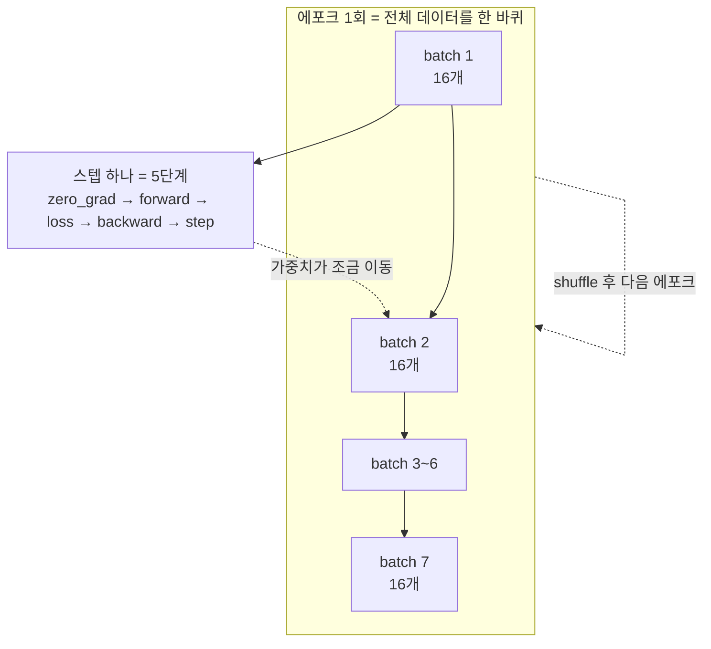
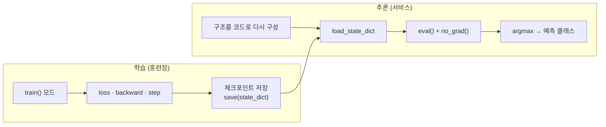

# 05 · 실제 학습 루프 — 미니배치·DataLoader·과적합

> 핵심 질문: 학습 데이터를 한 번에 다 쓰지 않고 잘게 쪼개면(미니배치) 무엇이 달라지는가?
> 선행: 04장. 소요: 30분.

## 5.1 왜 batch를 쪼개는가

04장에서는 3개 샘플을 통째로 집어넣고 돌렸습니다. 세 개였으니까 가능했던 일이죠. 실제 데이터는
수백만 개 단위라, 메모리에 한 번에 올리는 것 자체가 무리예요.

매번 전부를 쓰는 것보다 작은 무작위 조각의 평균 기울기를 쓰는 편이 빠릅니다. 때로는 성적까지 더
좋게 나와요. 미니배치가 표준이 된 이유는 이 두 개뿐입니다.

| 방식 | 1스텝마다 쓰는 데이터 | 특징 |
|------|---------------------|------|
| Full-batch GD | 전부 | 정확하지만 느림·메모리 |
| Mini-batch SGD (표준) | `batch_size`개 | 균형 |
| SGD (stochastic) | 1개 | 빠르지만 요란 |

`x=[1,2,3]` 예제를 100개 샘플의 노이즈 있는 회귀로 확장해서, 직접 돌려보며 확인해볼게요.

## 5.2 DataLoader — 데이터를 흘려보내는 파이프

PyTorch는 역할을 나눠놨습니다. `TensorDataset`( tensor 묶음 )과 `DataLoader`( 배치로 잘라 순회 )가
그거예요. 한쪽은 묶고, 한쪽은 자릅니다. 둘로 갈라놓은 이유는 나중에 드러나요. 지금은 묶는 역할,
자르는 역할 정도로만 기억하셔도 충분합니다.

```python
import torch

torch.manual_seed(0)
N = 100
X = torch.rand(N, 1) * 10                    # x ∈ [0,10)
Y = 2 * X + 3 + torch.randn(N, 1) * 0.5      # y = 2x+3 + 노이즈

model = torch.nn.Linear(1, 1)
optimizer = torch.optim.SGD(model.parameters(), lr=0.02)
ds = torch.utils.data.TensorDataset(X, Y)
dl = torch.utils.data.DataLoader(ds, batch_size=16, shuffle=True)

for epoch in range(300):
    total = 0.0
    for xb, yb in dl:                        # ① batch 순회
        optimizer.zero_grad()                # ② (2.3 누격 방지)
        loss = torch.nn.functional.mse_loss(model(xb), yb)
        loss.backward()
        optimizer.step()                     # ③ 04장 5단계가 batch마다 반복
        total += loss.item() * xb.size(0)
    if epoch in (0, 99, 299):
        print(f"epoch {epoch:>3}  avg train loss {total / N:.4f}")

print("W =", round(model.weight.item(), 3), " b =", round(model.bias.item(), 3))
```

실측:

```text
epoch   0  avg train loss 128.5118
epoch  99  avg train loss 0.2376
epoch 299  avg train loss 0.2193
W = 2.028  b = 3.194
```

`W→2, b→3`에 근접하게 붙었습니다. 노이즈가 섞여 있으니 loss가 0은 아니에요. 잔차가 분산
≈0.25쯤으로 남기 때문이죠. 중요한 건 평균 기울기가 목표에 수렴한다는 사실입니다.

`shuffle=True` 덕분에 매 에포크 batch 구성이 바뀌어요. 그래서 local minimum에 갇히지 않습니다.

- `for xb, yb in dl`을 한 바퀴 도는 것이 1 에포크입니다.
- `loss = ...; total += loss.item()*len` 을 쓴 이유는 batch마다 크기가 다르기 때문이에요. 개수로
  가중치를 둔 평균을 낸 것입니다.
- `torch.nn.functional.mse_loss`(함형 API)는 `MSELoss()` 객체와 같은 일을 합니다. `nn.functional.*`은
  "층 없이 함수만" 쓰고 싶을 때 꺼내 쓰는 창고예요.

<!-- diagrams:inserted -->:book/05_training_loop.md###-5.3-5단계가-batch마다-돌아간다

용어가 두 겹이라 헷갈리니 중첩 구조로 그려둡니다. 바깥이 에포크, 안이 스텝이에요. 아래 예는 N=100에 batch 16이라 한 에포크가 대략 7 스텝입니다.



## 5.3 5단계가 batch마다 돌아간다

에포크 안으로 들어가서 펼쳐보면 이렇습니다.

```text
for epoch:                       # 전체 데이터를 몇 번 볼 것인지
    for xb, yb in dl:            #   mini-batch씩
        zero_grad → forward → loss → backward → step
```

즉 **에포크 = batch 루프의 횟수**, 스텝(step)은 batch 하나를 처리하는 일입니다. 데이터 100개에
batch 16을 적용하면 에포크당 약 7 스텝이 나와요.

혼동은 여기서 생깁니다. 학습률을 이야기할 때는 기준이 에포크가 아니라 스텝이라는 점이죠. 앞에서
학습률을 이리저리 만져본 기억이 있으면 이 구분이 갑자기 실감이 나실 거예요.

## 5.4 과적합 — train loss만 보면 빠지는 함정

합성 3클러스터 데이터로 MLP 분류기를 만들어볼게요. train loss는 금방 0으로 떨어집니다. 여기서
방심하면 지는 거예요.

```python
import torch

torch.manual_seed(0)
centers = torch.randn(3, 2) * 4
X, Y = [], []
for ci in range(3):
    X.append(centers[ci] + torch.randn(50, 2))
    Y.append(torch.full((50,), ci, dtype=torch.long))
X = torch.cat(X)                    # (150, 2)
Y = torch.cat(Y)                    # (150,)  int64 (클래스 레이블)

clf = torch.nn.Sequential(
    torch.nn.Linear(2, 16), torch.nn.ReLU(), torch.nn.Linear(16, 3)
)
opt = torch.optim.Adam(clf.parameters(), lr=0.05)
lossf = torch.nn.CrossEntropyLoss()

for epoch in range(100):
    opt.zero_grad()
    logits = clf(X)                 # (150, 3) 원-hot 점수
    loss = lossf(logits, Y)         # Y는 int64 클래스 index 기대
    loss.backward()
    opt.step()
    if epoch in (0, 49, 99):
        acc = (logits.argmax(1) == Y).float().mean().item()
        print(f"epoch {epoch:>3}  loss {loss.item():.4f}  acc {acc:.2%}")
```

실측:

```text
epoch   0  loss 1.8487  acc 0.00%
epoch  49  loss 0.0000  acc 100.00%
epoch  99  loss 0.0000  acc 100.00%
```

train 정확도 100%, loss 0입니다. 보고서에 넣기 딱 좋은 숫자죠. 그런데 이걸 "좋다"고 할 수
있을까요?

3개의 blob이 서로 잘 떨어져 있어서, 모델이 패턴을 익히지 않고 답을 외울 수 있습니다. 실제 배포
데이터는 노이즈가 있고 본 적 없는 위치에 점이 찍히니 이렇게까지 맞지 않아요. **train만 보고
판단하면 과적합을 모릅니다.**

### CrossEntropy 약정 2가지 (오류의 90%가 이것)

이름은 거창한데 내용은 짧습니다. 딱 두 개예요.

1. `logit`은 raw 점수입니다. `softmax`를 직접 치면 안 돼요. `CrossEntropyLoss`가 내부에서
   `log_softmax + NLL` 을 수치 안정적으로 합쳐 처리하기 때문입니다.
2. 레이블 `Y`는 int64 클래스 인덱스 (`[0,1,2,...]`)를 기대합니다. one-hot을 기대하지 않아요.
   float나 one-hot을 주면 shape 에러가 납니다. 04장 분류 헤드에서 `argmax`로 예측 클래스를 얻는
   이유도 이것입니다.

> 과적합을 다루려면 **train/test split**과 검증 loss 모니터링(train은 계속 줄지만 val이 오르기
> 시작하는 지점 = early stop)이 필요합니다. 이건 부록 A의 "확인해야 할 다음 개념"으로 넘깁니다.

<!-- diagrams:inserted -->:book/05_training_loop.md###-5.5-모델-저장·복원-(state_dict)-—-한-장의-실용

학습과 추론은 한 코드 안에서 모드만 바꿔 돌지만, 역할은 완전히 다릅니다. 04장의 `eval()`·`no_grad()` 가 이 지점에서 하나로 만나요.



## 5.5 모델 저장·복원 (state_dict) — 한 장의 실용

학습된 모델을 파일로 남기고 다시 쓰는 일입니다. 06장과 프로젝트에서 필수로 쓰게 돼요. 지금까지와
달리 이 절은 그냥 따라 치시면 됩니다.

```python
import torch
# clf는 위에서 학습된 상태라 가정
path = "model.pt"
torch.save(clf.state_dict(), path)          # 파라미터 사전만 저장

fresh = torch.nn.Sequential(
    torch.nn.Linear(2, 16), torch.nn.ReLU(), torch.nn.Linear(16, 3)
)
fresh.load_state_dict(torch.load(path))     # 구조가 같아야 함
fresh.eval()                                # 추론 모드 (드롭아웃/BN 끔)
with torch.no_grad():                       # 2.4: 추론도 추적 불필요
    pred = fresh(X[:1]).argmax(1).item()
```

이 코드의 실측:

```text
loaded model predicts class for first blob point: 0 (true: 0 )
```

- `state_dict()`만 저장하는 이유, 궁금하셨죠? 가장 이식성 높고 안전하기 때문입니다. pickle로 전체
  객체를 저장하는 방법은 권장되지 않아요.
- `eval()`과 `train()`이 나뉘어 있는 건 드롭아웃·BatchNorm이 학습과 추론에서 다르게 동작하기
  때문이에요. 추론 전에 `eval()`을 붙이는 건 선택이 아니라 필수입니다.
- 추론에는 `no_grad()` 또는 `torch.inference_mode()`를 씁니다. 기울기가 필요 없으니 메모리와
  속도를 함께 절약할 수 있어요.

## 정리

1. 데이터를 잘게 shuffle해 batch마다 5단계 → 04장의 스케일아웃판.
2. **에포크 = 전체 1순회, 스텝 = batch 1처리.** lr·스텝 단위 혼동 금지.
3. train loss 0은 과적합일 수 있다. 검증 집합이 없으면 일반화를 모른다.
4. 분류는 `CrossEntropyLoss`: raw logits + int64 index. `logits.argmax`로 예측.
5. `save(state_dict)` → `load_state_dict` + `eval()` + `no_grad()`가 실전 저장·추론 3종.

## 직접 해보기

`book/code/ch05_minibatch.py`:
1. `batch_size`를 4와 64로 바꿔보며, 학습 곡수가 얼마나 매끄러워지는지 어디에서 거칠어지는지
   관찰하세요.
2. 5.4의 학습 데이터에서 blob 간 거리를 줄여(중복되게) 바꾸면, test 없이도 loss가 안 떨어지는 걸
   볼 수 있나요?
3. `shuffle=False`로 두고 학습이 어떻게 달라지는지 비교하세요(특정 순서에 치우침).

다음: 2D 점이 아니라 **픽셀 격자(이미지)** 를 인식하는 층 — [06장 CNN](06_cnn_vision.md).
