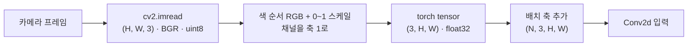
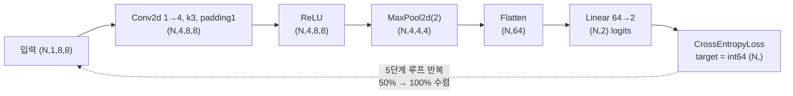

# 06 · 이미지 분류 — CNN의 기본 구조

> 핵심 질문: 픽셀 격자를 입력받아 "이 이미지엔 무엇이 있는가"를 답하는 모델은 어떻게 생기나?
> 선행: 04, 05장. 소요: 35분. 로봇 비전(`03_ai_vision` 목표)으로의 교두보.

## 6.1 이미지는 `(채널, 세로, 가로)` tensor

01장의 감각으로 잠깐 돌아가볼게요. 이미지를 tensor로 보면 `(C, H, W)` shape의 숫자 격자입니다.
컬러든 흑백이든 결국 숫자가 사각형으로 앉아 있는 모양이에요.

- 흑백 8×8 → `(1, 8, 8)`, RGB 64×64 → `(3, 64, 64)`.
- batch를 붙이면 `(N, C, H, W)`. PyTorch의 `Conv2d`는 여기서 정확히 4D를 기대합니다.

로봇 카메라 프레임 한 장도 똑같습니다. `cv2.imread`가 `(H, W, 3)` (OpenCV는 BGR·채널 순서 마지막)으로
주기만 할 뿐인데, PyTorch가 받는 쪽은 `(N, 3, H, W)` 형태예요. 그래서 채널을 앞으로 당기고 batch 축을
하나 더 붙여야 합니다. `permute(0,3,1,2)` 같은 변환이 여기서 나오는 코드예요(`opencv/image_basic.py`와
연결).

<!-- diagrams:inserted -->:book/06_cnn_vision.md###-6.2-Fully-connected로는-왜-안-되는가

로봇 카메라에서 `Conv2d`까지 가는 실제 경로입니다. 왼쪽이 OpenCV가 주는 모양이고 오른쪽이 PyTorch가 요구하는 모양이라, 가운데 변환이 반드시 필요합니다.



## 6.2 Fully-connected로는 왜 안 되는가

`Linear`로 28×28 이미지를 바로 받으려면 784개 픽셀을 납작하게 펴야 합니다. 문제는 그렇게 펴는 순간
세 가지가 한꺼번에 깨진다는 거예요.

- 인접 픽셀의 **공간 관계(패턴·모서리·획)** 가 평면화되면서 사라집니다.
- 픽셀 위치가 1칸만 어긋나도 입력 벡터가 완전히 달라져요. 위치에 매우 민감합니다.
- 파라미터가 폭증합니다(28×28→100000급).

CNN은 이 세 개를 정면으로 돌파하지 않고 방향을 틀어요. 작은 창(커널)을 훑으며 지역 패턴을 추출하는
식이죠. 01장의 합성 연산이 위치와 무관한 필터를 만들던 것과 같은 결입니다.

## 6.3 Conv2d — 픽셀 격자 위의 sliding window

```python
import torch

conv = torch.nn.Conv2d(
    in_channels=1, out_channels=4, kernel_size=3, padding=1
)
img = torch.randn(2, 1, 8, 8)          # (batch 2, C1, 8, 8)
feat = conv(img)                        # 4개 필터로 스캔
print("in :", tuple(img.shape))
print("out:", tuple(feat.shape))
print("kernel tensors:",
      sum(p.numel() for p in conv.parameters()))
```

```text
in : (2, 1, 8, 8)
out: (2, 4, 8, 8)
kernel tensors: 40
```

출력 세 줄을 하나씩 열어보겠습니다.

- `out_channels=4` 라면 서로 다른 3×3 필터가 4개 뜨고, 각 채널에 하나의 특성맵을 냅니다.
- `padding=1` 덕분에 가로세로 8이 유지됐습니다. 커널 3×3에 한 칸을 채우면 "주변 1픽셀을 봐도 크기
  보존"이라는 뜻이에요. `out_hw = (in_hw + 2·padding − kernel)/stride + 1 = (8+2−3)/1+1 = 8`.
- 파라미터 수를 세면 필터가 4개, 각각 `1·3·3=9` 가중치 + bias 1 = `(9+1)·4 = 40`입니다. 여기서
  정말 봐야 할 건 **입력 해상도와 무관**하다는 사실이에요. 커널이 위치마다 공유되니까요(weight
  sharing).

> `Conv2d`는 "채널 방향을 축으로 둔 지역 행렬곱"입니다. `Linear`가 위치를 무시하고 전부 연결하는
> 것과 달리, **가까운 픽셀만** 연결하고 그 연결을 전역에서 재사용합니다.

## 6.4 풀링 — 크기를 줄이며 강건하게

`MaxPool2d(2)`은 2×2 블록에서 최댓값만 남기는 층입니다. 해상도는 절반으로 줄어요. 할 일은 이것뿐인데,
빼면 금방 후회하게 되는 층이기도 합니다.

- 위치가 좀 흔들려도 최대 반응은 남습니다. 평행 이동에 강건해지는 거죠.
- 연산량과 파라미터를 줄여주니 다음 층을 쌓기가 쉬워요.

그래서 "버리는 층"이 아니라 "흔들림을 허용하는 층"으로 읽는 편이 맞습니다.

## 6.5 전체 분류기 — 합성 8×8 두 클래스로 검증

`03_ai_vision` 목표인 "이미지 분류 모델의 기본 구조"를 torchvision 없이 실현합니다.

**아래=밝음 vs 위=밝음** 을 위치로 구분하는 합성 이미지예요. 패턴이 복잡한 게 아니라 위치만 다른
데이터니, 모델이 커널을 통해 뭘 배우는지 맨눈으로 추적할 수 있습니다.

```python
import torch

torch.manual_seed(0)

def make_toy(n_per=40):
    xs, ys = [], []
    for c in range(2):                       # 클래스 0/1
        base = torch.zeros(n_per, 1, 8, 8)
        if c == 0:
            base[:, :, 4:8, :] = 1.0          # 아래쪽이 밝음
        else:
            base[:, :, 0:4, :] = 1.0          # 위쪽이 밝음
        base += 0.1 * torch.randn_like(base)  # 노이즈
        xs.append(base); ys.append(torch.full((n_per,), c, dtype=torch.long))
    return torch.cat(xs), torch.cat(ys)


X, Y = make_toy()
perm = torch.randperm(X.size(0))              # 샘플 순서 섞음 (RNG 상태에 영향)
X, Y = X[perm], Y[perm]
net = torch.nn.Sequential(
    torch.nn.Conv2d(1, 4, kernel_size=3, padding=1),  # (N,1,8,8)->(N,4,8,8)
    torch.nn.ReLU(),
    torch.nn.MaxPool2d(2),                             # ->(N,4,4,4)
    torch.nn.Flatten(),                                # ->(N,64)
    torch.nn.Linear(4 * 4 * 4, 2),                     # 분류 헤드 -> 2 classes
)
opt = torch.optim.Adam(net.parameters(), lr=0.01)
lossf = torch.nn.CrossEntropyLoss()

for epoch in range(30):
    opt.zero_grad()
    logits = net(X)
    loss = lossf(logits, Y)
    loss.backward()
    opt.step()
    if epoch in (0, 14, 29):
        acc = (logits.argmax(1) == Y).float().mean().item()
        print(f"epoch {epoch:>2}  loss {loss.item():.4f}  acc {acc:.1%}")
```

실측:

```text
epoch  0  loss 0.7321  acc 50.0%
epoch 14  loss 0.0069  acc 100.0%
epoch 29  loss 0.0002  acc 100.0%
```

`acc 50%`에서 출발해 100%로 수렴했습니다. 출발점의 그 수치는 말 그대로 추첨으로 얻은 성적이었어요.
5단계 루프(04장)는 그대로고, 달라진 건 `model(X)` 자리가 `Conv→ReLU→Pool→Flatten→Linear`로 바뀐
것뿐입니다.

## 6.6 CNN 골격 — "특성 추출 + 분류 헤드"

```text
[이미지] → (Conv + ReLU + Pool) 반복  → (Flatten) → (Linear → logits)
            특성 추출 (시각 패턴)         1D화        분류 헤드 (의사결정)
```

이 분할이 거의 모든 비전 모델의 공통 설계입니다. ViT든 ResNet이든 바뀌는 건 헤드 쪽이에요.
`03_ai_vision/README.md`의 흐름도(이미지→OpenCV→인식→CNN→인지)에서 CNN이 앉아 있는 자리가 바로
여기입니다.

### `ReLU`는 왜 필수인가

Conv도 Linear도 본질은 선형 연산입니다. 선형만 쌓으면 하나의 선형으로 요약되어(합성) 결국 회귀와
같아져요. `ReLU(x)=max(0,x)`라는 비선형이 층 사이를 가로막아야 복잡한 경계가 그려집니다.

- ReLU 외 선택지: `GELU`(Transformer·ViT), `LeakyReLU`(죽은 뉴런 보완). 기본은 ReLU로 가세요.

### 05장 과적합 경계는 여기에도

합성 데이터라서 100%가 쉬웠죠. 실제 MNIST나 자율주행 영상에서는 train 100%여도 test는 다릅니다.
CNN은 파라미터가 많아 **과적합이 더 흔**한 쪽이에요. 데이터 증강(회전·크롭), dropout, 검증 집합이
프로젝트 단계(`06_projects`)에서 필요해지는 지점입니다.

<!-- diagrams:inserted -->:book/06_cnn_vision.md###-정리

6.5의 네트워크를 통과하며 모양이 어떻게 줄어드는지가 이 장의 전부라고 해도 됩니다. 아래 값은 6.3과 6.5에서 실측으로 확인한 그대로예요.



## 정리

1. 이미지 = `(N, C, H, W)` tensor. OpenCV는 `(H,W,C)`, 순서 변환 필요.
2. `Conv2d`: 위치 공유 필터로 지역 패턴 추출. **파라미터가 해상도와 무관**(weight sharing).
3. `MaxPool`: 크기 축소 + 위치 강건성. `padding`/`stride`로 out shape 계산.
4. CNN = [특성 추출] + [분류 헤드]. 학습 루프 5단계는 04·05와 동일.
5. `ReLU`가 선형들의 합성을 막아 비선형 경계를 만든다.
6. 분류 손실은 `CrossEntropyLoss`(raw logits + int64 index).

## 직접 해보기

`book/code/ch06_cnn.py`:
1. `out_channels`를 4→8로 늘리면 파라미터와 수렴 속도가 어떻게 변하는지 확인해보세요.
2. `MaxPool2d(2)`를 빼면(해상도 유지) Flatten 후 `Linear` 입력 크기를 어떻게 고쳐야 할까요?
3. 노이즈 `0.1`→`1.0`으로 키워보세요. acc가 어디서 무너지는지 보며 "검증 집합 필요"를 체감하면 됩니다.

다음: [07장 실습 과제](07_exercises.md) — 원본 README의 과제 3개를 동작 코드로.
