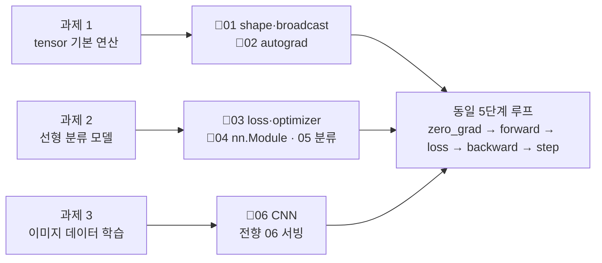

# 07 · 실습 과제와 해답

> 원본 `README.md`의 실습 과제 3개를 동작하는 코드와 실측 출력으로 풀어냅니다.
> 선행: 01~06장. 과제마다 스스로 해본 뒤 해답을 보세요.

해답을 먼저 펼치시는 분, 그 마음 압니다. 이번 장은 어렵지 않거든요. 다만 손으로 한 번은 부딪혀
봐야 하는 장이기도 합니다. 스스로 돌려보고 나면 "어, 이거 앞에서 본 학습 루프인데?" 하는 순간이
오는데, 그 낯익음을 직접 잡는 게 이 장의 목적이에요.

원본 과제:
1. tensor 기본 연산 실습
2. 간단한 선형 분류 모델 구현
3. MNIST 또는 간단한 이미지 데이터 학습

---

## 과제 1 — tensor 기본 연산

**요구**: 생성·연산·shape 조작을 한 화면에서 확인한다.

```python
import torch

t = torch.arange(12)
print("arange(12) ->reshape(3,4)=", t.reshape(3, 4).tolist())
print("transpose(0,1)=", t.reshape(3, 4).T.tolist())
print("float() dtype:", t.float().dtype)
```

```text
arange(12) ->reshape(3,4)= [[0, 1, 2, 3], [4, 5, 6, 7], [8, 9, 10, 11]]
transpose(0,1)= [[0, 4, 8], [1, 5, 9], [2, 6, 10], [3, 7, 11]]
float() dtype: torch.float32
```

**채점 포인트**
- `arange`는 `int64` → 모델에 쓰려면 `float()` 캐스팅이 필요함을 알았나요.
- `.T`/`reshape`가 view인지 copy인지 궁금해했나요 (reshape는 가능하면 view를 돌려줍니다).

---

## 과제 2 — 간단한 선형 분류 모델

**요구**: `nn.Module`(또는 `nn.Sequential`)로 다중 클래스 분류기를 만들어 학습한다.
`simple_classifier.py`가 "값 예측(회귀)"였다면, 이번엔 분류(05·06장 CrossEntropy)예요.

아래는 MNIST가 없어도 도는 합성 손글씨풍 2분류입니다. 이미지를 `16×16` 격자로 만들고 세로선 vs
가로선을 분류하죠. 실제 MNIST를 쓸 때는 `torchvision`을 설치하고 `MNIST(...)`으로 `X, y`만
바꿔주면 이 학습 코드가 그대로 돌아갑니다.

```python
import torch

torch.manual_seed(1)
imgs, lab = [], []
for c in range(2):
    a = torch.zeros(30, 16, 16)
    if c == 0:
        a[:, :, 6:10] = 1.0        # 세로선
    else:
        a[:, 6:10, :] = 1.0        # 가로선
    a += 0.05 * torch.randn_like(a)
    imgs.append(a)
    lab.append(torch.full((30,), c, dtype=torch.long))
imgs = torch.cat(imgs).reshape(-1, 16 * 16)   # (60, 256) 1D로 펼침
lab = torch.cat(lab)

mlp = torch.nn.Sequential(
    torch.nn.Linear(256, 32), torch.nn.ReLU(), torch.nn.Linear(32, 2)
)
opt = torch.optim.Adam(mlp.parameters(), lr=0.01)

for e in range(50):
    opt.zero_grad()
    out = mlp(imgs)
    loss = torch.nn.functional.cross_entropy(out, lab)
    loss.backward()
    opt.step()
    if e in (0, 49):
        acc = (out.argmax(1) == lab).float().mean().item()
        print(f"epoch {e:>2} loss {loss.item():.4f} acc {acc:.1%}")
```

```text
epoch  0 loss 0.6706 acc 98.3%
epoch 49 loss 0.0000 acc 100.0%
```

첫 줄부터 거의 다 맞히고 시작하죠. 모델이 똑똑해서가 아니라 데이터가 단순해서예요. 이 둘은 결과가
같아 보여도 이유가 완전히 다릅니다. 나중에 남의 성적을 읽을 때 이 구분이 손에 익어 있을 거예요.

**해설**
- `cross_entropy`가 내부에서 `log_softmax` + 정답 레이블 NLL을 합칩니다(05장 4장 약정).
- 1D `Linear`만으로도 위치가 고정된 합성 데이터는 맞출 수 있습니다. 그런데 한 칸만 어긋나도
  무너지는 게 6.2의 "위치 민감" 문제예요. 그래서 6장의 Conv를 쓰는 겁니다.
- 실제 MNIST로 옮기는 법: `dataset = torchvision.datasets.MNIST(root, train=True, download=True, transform=ToTensor())` →
  `DataLoader(...)`로 6.5처럼 학습. 이미지가 1×28×28이므로 `Linear(784, ·)` 대신 6.5 CNN 골격을 쓰세요.

**채점 포인트**
- forward가 `(N, 클래스)`를 내는지, `CrossEntropyLoss`가 `(N,)` int64를 기대하는지 확인했나요.
- 학습 데이터가 단순해 early acc가 높게 나온 원인(과적합 경계, 5.4)을 설명할 수 있나요.

---

## 과제 3 — 간단한 이미지 데이터 학습 (CNN)

**요구**: 이미지 형식 `(N,C,H,W)`에 CNN을 적용해 분류(`06_cnn_vision.md` 6.5 코드).

→ 06장 6.5의 합성 8×8 분류기가 이 과제의 해답 그 자체입니다. 일부러 다시 쓰지 않았어요. 같은
코드를 두 번 쓰는 게 아니라, 앞에서 본 루프 위에 이미지를 얹은 결과가 그 코드입니다.
`book/code/ch06_cnn.py`를 실행하면 `50% → 100%` 수렴을 볼 수 있습니다.

심화 체크리스트:
- [ ] `out_channels`, `kernel_size`, 층 수를 바꿔 수렴 속도를 비교했는가.
- [ ] 이미지의 정규화(값을 [0,1]이나 평균0/분산1로)를 넣으면 무엇이 좋아지는가 이해했는가.
- [ ] train/test split을 만들어 검증 acc도 찍었는가(05.4 과적합 대비).
- [ ] 학습된 모델을 `state_dict`로 저장→`eval()`→추론(05.5)까지 해 보았는가.

---

## 확장 과제 (원본에 없던 추천)

| # | 과제 | 근거 장 |
|---|------|--------|
| E1 | `simple_classifier.py`를 `nn.Module` 8줄로 재작성, 원본과 결과 비교 | 04장 |
| E2 | 회귀가 아닌 **노이즈 있는 데이터**로 바꿔 lr 탐색(적정값 찾기) | 03·05장 |
| E3 | `opencv/image_basic.py`의 grayscale 출력을 tensor화해 CNN에 입력 | 06장 |
| E4 | 검증 집합·early stopping 추가해 5.4 과적합 방지 데모 | 05장 |

<!-- diagrams:inserted -->:book/07_exercises.md###-정리

과제 세 개가 사실은 하나의 학습 루프를 데이터 크기로만 밀어본 것이라, 어떤 장에 막히는지 대응시켜뒀습니다.



## 정리

세 과제는 사실 하나의 학습 루프를 tensor → 분류 → 이미지로만 확장한 것입니다.
과제 1이 tensor, 과제 2가 "분류의 손실/약정", 과제 3이 "이미지의 shape/CNN".
이 셋이 원본 `README.md`의 "학습 목표"를 정확히 소진합니다.
