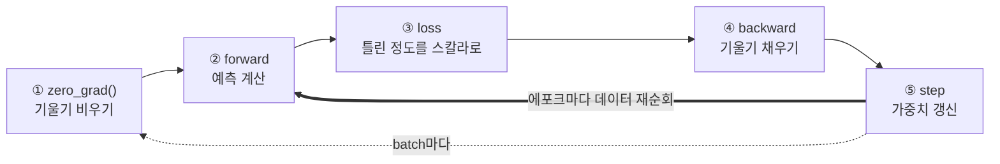

# PyTorch로 시작하는 딥러닝 — tensor에서 이미지 분류까지

> `03_ai_vision/pytorch` 폴더의 학습 메모와 `simple_classifier.py` 한 편을,
> 처음부터 이미지 분류까지 단계별로 따라가는 전문 기술 도서로 재구성한 것입니다.
> 이 폴더에 적혀 있던 다섯 가지 핵심 어휘 — **tensor operations · loss function ·
> optimizer · model training · 이미지 분류 모델의 기본 구조** — 이 곧 이 책의 챕터 순서입니다.

- **지은이 / 대상**: 로봇 비전·물리 AI를 학습 중인 개발자예요. 파이썬 기초와 `numpy` 행렬 감각이 있다고 가정하고 출발합니다.
- **검증 환경**: PyTorch 2.8.0+cpu, Python 3.x, NVIDIA GPU 없음(CPU 전용). `torchvision`·`matplotlib`은 미설치입니다.
- **재현 원칙**: 책에 등장하는 모든 코드 블록과 숫자는 위 환경에서 실제로 실행한 결과입니다. 임의 수치는 쓰지 않았어요. 시드 고정 코드(`torch.manual_seed`)는 그대로 재현됩니다.

---

## 이 책의 한 줄 요약

> 경사 하강법이라는 하나의 반복문만 이해하면, 선형 회귀도 손글씨 분류도 같은 골격이다.
> 이 책은 그 골격을 **수작업(tensor·autograd)** 으로 세운 뒤 **PyTorch가 대신해주는 부분(`nn`·`optim`)** 으로 이월시키는 순서로 읽힌다.

---

## 목차

| 장 | 제목 | 다루는 것 | 원본 메모 대응 |
|----|------|-----------|----------------|
| [00](00_preface.md) | 서문 · 환경 설정 | 버전 확인, CPU/GPU, 재현 시드 | 학습 목표 |
| [01](01_tensors.md) | Tensor — 데이터를 담는 그릇 | 생성·연산·`shape`·broadcasting | `tensor operations` |
| [02](02_autograd.md) | Autograd — 기울기의 자동화 | `requires_grad`, `backward()`, 계산 그래프 | `loss function`(접근) |
| [03](03_loss_optimizer.md) | Loss와 Optimizer — 학습의 두 바퀴 | MSE, 경사 하강법, 학습률, 발산 | `loss function`·`optimizer` |
| [04](04_first_model.md) | 첫 모델 — `nn.Module`으로 다시 쓰기 | `Linear`·`MSELoss`·`SGD`, 학습 루프 5단계 | `model training` |
| [05](05_training_loop.md) | 실제 학습 루프 — 미니배치·Data·과적합 | `DataLoader`, 에포크, 일반화 | `model training` |
| [06](06_cnn_vision.md) | 이미지 분류 — CNN의 기본 구조 | `Conv2d`·`ReLU`·`MaxPool`, 분류 헤드 | `이미지 분류 모델` |
| [07](07_exercises.md) | 실습 과제와 해답 | 원본 과제 3개를 동작 코드로 | `실습 과제` |
| [A](appendix_cheatsheet.md) | 부록 — API 치트시트·용어·트러블슈팅 | 한눈표 | 핵심 포인트 |


---

## 이 책의 출발점: `simple_classifier.py`

이 폴더에 원래 있던 예제 한 편이 책 전체의 실마리예요. 4줄이면 읽힙니다.

```python
import torch

# Simple linear model: y = W*x + b
W = torch.tensor([[2.0]], requires_grad=True)
b = torch.tensor([1.0], requires_grad=True)

x = torch.tensor([[1.0], [2.0], [3.0]])
y_true = torch.tensor([[5.0], [7.0], [9.0]])

for _ in range(100):
    y_pred = x @ W + b
    loss = ((y_pred - y_true) ** 2).mean()
    loss.backward()
    with torch.no_grad():
        W -= 0.01 * W.grad
        b -= 0.01 * b.grad
        W.grad.zero_()
        b.grad.zero_()

print(f"W = {W.item():.4f}")
print(f"b = {b.item():.4f}")
```

이 코드를 이 환경에서 실행하면:

```text
W = 2.5795
b = 1.6827
```

주석과 다른 숫자가 나와서 화면을 한 번 더 봤다면, 그 반응이 정상이에요. 여기서 이 책이 시작하는 질문이 두 가지입니다.

1. `x=[1,2,3] → y=[5,7,9]`의 진짜 관계는 무엇이고, 왜 답은 `W=2, b=1`(주석)이 아닐까요?
   → 실제로는 `y = 2x + 3`입니다. 주석의 "y = W*x + b"는 *모델의 모양*을 쓴 것이지 정답이 아니에요. 그런데 학습 후 값은 `b=1.68`로 3에 한참 못 미칩니다. 왜 그럴까요?
2. 왜 `W`·`b`를 `no_grad()` 안에서 직접 갱신했을까요? PyTorch는 이걸 대신해주지 않을까요?

01장부터 이 두 질문에 순서대로 답하면서, 예제를 "더 가독성 있고 정확한" 형태로 다시 지어볼게요. 04장이 되면 위 코드와 동일한 일을 하는 `nn.Module` 버전을 8줄로 줄일 수 있습니다.

---

<!-- diagrams:inserted -->

학습 루프 다섯 단계를 순환 하나로 줄여뒀습니다. 이 책이 05장까지 반복해서 말하는 게 정확히 이 그림이고, 04장에서 처음 만나요.



## 읽는 방법

- 한 장이 한 개념이에요. 20~30분이면 한 장이고, 챕터 끝 "정리"와 "직접 해보기"까지 마저 하는 것을 권장합니다.
- 코드 블록은 복붙해서 바로 도는 완전한 조각입니다. 장별로 앞 변수를 재사용하지 않도록 매번 선언해 뒀어요.
- GPU가 없어도 전부 CPU에서 돌아갑니다. 오래 걸릴 것 같은 예제는 일부러 작게 설계했습니다.
- 숫자가 궁금하면 `book/code/`의 스크립트를 그대로 실행하면 됩니다.

```text
book/
├── code/                 # 이 책의 모든 예제 실행용 스크립트
│   ├── ch03_learning_rate_lab.py
│   ├── ch04_first_model.py
│   ├── ch05_minibatch.py
│   └── ch06_cnn.py
└── *.md                  # 00~07장 + 부록
```

> **원본 산출물 보존**: `../README.md`와 `../simple_classifier.py`는 이 책의 근거 자료이므로
> 수정하지 않았습니다. 원 예제를 `nn.Module`로 옮긴 대조판은
> [`code/ch04_first_model.py`](code/ch04_first_model.py)에 있습니다.

---

*시작하려면 → [00. 서문 · 환경 설정](00_preface.md)*
