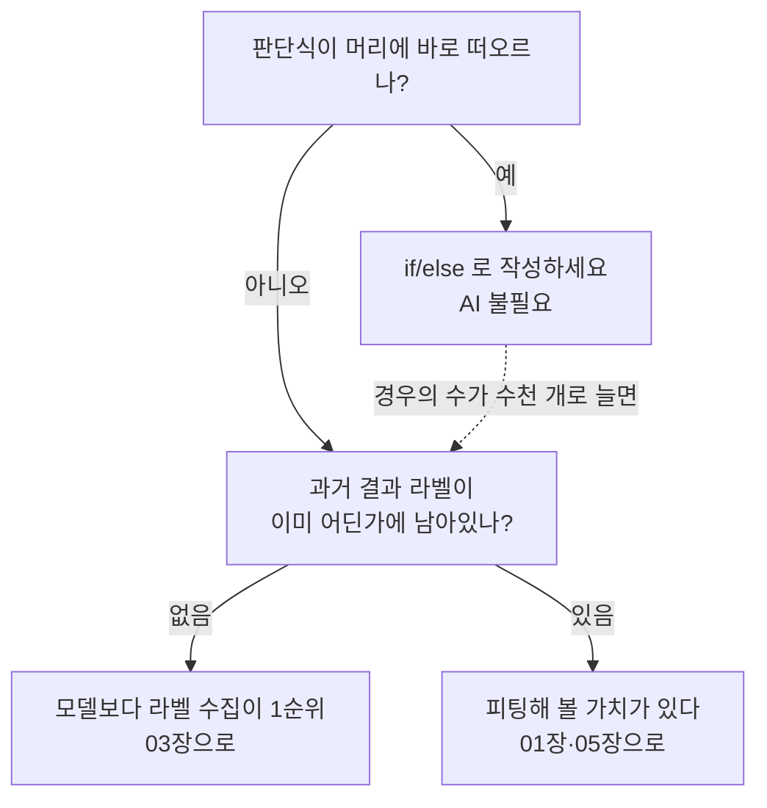

# 00 · 전향자를 위한 서문 — 무엇이 정말 다른가

> 목적: "AI가 어려운 이유"가 사실은 **일하는 방향이 반대인 탓**임을 확인한다.
> 소요: 15분. 코드는 없습니다. 대신 이 책 전체의 지도를 받아가세요.

## 0.1 당신이 잘하는 것과, 여기서 안 통하는 것

수년을 코드 짜온 사람이 AI에서 헤매는 이유는 기본기 때문이 아니에요. 기본기는 오히려 충분합니다.
문제는 그 기본기가 서 있는 바닥이죠. 몸에 밴 전제 6개가 AI에서는 성립하지 않습니다.

| # | 일반 개발에서 몸에 밴 전제 | AI에서의 실제 |
|---|---------------------------|---------------|
| 1 | **판단식을 내가 작성한다** | 판단식을 데이터가 고르게 한다. 나는 데이터와 목적식을 만든다 |
| 2 | 로직은 **상태가 없다** (순수 함수) | 모델은 상태 그 자체다. 가중치 = 100만 개짜리 전역 상태 |
| 3 | 입력이 같으면 출력이 같다 | `train()` 모드에서는 입력이 같아도 출력이 **달라진다**(04장 실측) |
| 4 | 단위 테스트가 통과하면 동작한다 | 학습 데이터에 **포함된 입력**만 통과한 셈. 미지의 입력은 통계로만 안다 |
| 5 | 버그는 스택트레이스를 남긴다 | 대표적 실패(과적합·누수)는 **에러 없이 조용히** 잘못된 답을 낸다(05장 실측) |
| 6 | 요구사항을 구현하면 끝 | 같은 코드·같은 모델에서 **데이터만 다시 모으면** 성능이 달라진다 |

1번이 나머지 5개를 설명합니다. 5개 전부 "내가 만드는 게 아니라 통계가 만들 때 발생하는 부수 효과"일
뿐이죠. 따로 공부할 과제가 아니라, 방향 차이에서 갈라진 가지들입니다.

## 0.2 방향이 반대로 돈다

기능을 구현할 때 당신의 업무 흐름은 대략 이렇습니다.

```text
요구사항 → 경우의 수 나열(if/switch) → 단위 테스트 → 배포
```

AI는 이 순서가 뒤집힙니다.

```text
원하는 출력의 예시(라벨) 수집 → 함수 형태는 대충 던짐 → 데이터로 형태를 맞춤
→ "경우의 수 나열"에 해당하던 것이 사라짐 → 대신 '평가'가 생김
```

그래서 AI 코드를 처음 열고 "로직이 없네" 싶으실 거예요. 그 반응 자체는 맞습니다. 로직이 없는 게
아니라 로직이 가중치 안에 압축되어 있을 뿐이거든요. 우리가 읽을 수 없어서 안 보이는 겁니다.

리뷰 중에 "그 많던 if는 어디로 갔지" 하고 파일 검색을 돌려본 감각, 여기서 그대로 재발합니다.

### 이건 나쁜 일이 아니다

경우의 수를 직접 나열하지 않으니, 당신이 미처 생각지 못한 경우의 수까지 배웁니다. 01장에서 같은
문제를 손으로 쓴 규칙과 피팅으로 경쟁시켜 보는데, 실측으로 80.5% vs 99.7%입니다. 좋죠. 대신 그
99.7%가 *왜* 그런지는 설명하지 못 합니다. 이 거래(trade-off)를 이해하는 게 전향의 본질입니다.

<!-- diagrams:inserted -->

그렇다면 "이걸 AI로 해야 하나"를 고르는 기준부터 그림으로 박아두는 게 순서상 맞습니다. 아래 질문에 "예"가 하나라도 나와야 AI로 넘어오는 거예요.



## 0.3 당신의 경험이 즉시 자산이 되는 곳

반대로, AI 쪽에서만 배운 사람이 부러워하는 영역도 있습니다. 이 책이 후반에 일부러 그쪽으로 데려가는 이유예요.

표의 오른쪽 열을 내려 읽다 보면 잠깐 멈추실 거예요. 대부분 이미 어제 하던 일들이라서요.

| 당신의 경력 | AI에서 곧장 먹히는 이유 |
|-------------|------------------------|
| API 설계·계약 (schema, versioning) | 추론 엔드포인트는 결국 API. 입력 검증·형태 규격은 순수 프론트/백엔드 실력 |
| DB·데이터 파이프라인·ETL | AI 실무 시간의 절반. `JOIN`·정제·결측 처리를 아는 사람은 여기서 남는다 |
| 로깅·모니터링·알림 | 모델 성능 저하(드리프트)를 잡는 건 ML이 아니라 **운영**이다 |
| 배포·CI·롤백 | 학습 파이프라인을 재현 가능하게 돌리는 일 = 파이프라인 엔지니어링 |
| 성능 프로파일링 | 추론 지연 예산(06장 실측)을 쪼개는 감각은 그야말로 그 감각 |
| 코드 리뷰·가독성 | 실험 노트가 아니라 재현 가능한 코드를 쓰는 사람은 드물다 |

> Physical AI(로봇)를 목표한다면 이 표는 더 강하게 적용됩니다. 인지·제어·안전 계층은
> **시스템 엔지니어링** 문제이지 모델 문제가 아닙니다. 이 저장소의 상위 로드맵
> ([Physical AI 요약](../../../physical-ai-study-summary.md))이 "AI보다 센서/제어를 먼저"라고
> 경고하는 것과 같은 뜻입니다.

## 0.4 이 책이 쓰지 않는 순서

일반 입문서는 "수학 → 완전미분 → 회귀 → 신경망 → MNIST → CNN" 순으로 갑니다. 학문적으로 필요한
순서이긴 하죠. 다만 그건 학문적 의존 순서일 뿐, 전향자의 실패 순서가 아닙니다.

전향자가 실제로 2주 만에 포기하는 지점은 정해져 있어요.

1. 학습은 되는데 **왜 되는지** 몰라서, 확장도 수정도 손대지 못 합니다 (→ 01장)
2. 손실은 계속 떨어지는데 실제 서비스는 **틀립니다** (→ 05장)
3. 노트북에서까지 됐는데 **배포가 안 됩니다** (→ 06장)
4. 뭘 데이터로 만들어야 할지 **감도 안 잡힙니다** (→ 03장)

그래서 이 책은 순서를 이렇게 잡았어요. 패러다임 → 자산 매핑 → 데이터 → 모델 → 평가 → 서빙 → 계획.
핵심은 03장과 05장을 04장보다 앞에, 혹은 바로 곁에 놓는 부분입니다. 모델 내부가 아니라 데이터와
평가가 1순위라는 뜻이에요.

## 0.5 이 책 전체를 30초로

- **01장**: 같은 원(circle) 문제를 손 규칙 vs 피팅으로 붙입니다. 손 규칙은 *형태를 맞혀야* 하는데,
  틀리면 96.6%에서 천장이 막혀요. 피팅은 형태를 모른 채 시작해서 99.7%에 갑니다. "내가 로직을 안
  쓴다"가 무엇인지 눈으로 확인하는 장입니다.
- **02장**: 22개 개념을 FE/BE 용어와 1:1로 대응시켜요. `env var ↔ hyperparameter`,
  `serialization ↔ state_dict` 같은 대응이죠. 이미 아는 걸 이름만 바꿔 다시 쓰는 장입니다.
- **03장**: 라벨, 스플릿, 피처를 다룹니다. 타깃 누수 실험에서는 test accuracy 1.00이 나와요. 좋은
  게 아니라 데이터에 정답이 새어든 사고입니다.
- **04장**: 모델은 상태예요. `train()`에서는 같은 입력의 출력이 두 번 다르고, `eval()`에서는 같습니다.
- **05장**: 불균형 데이터에서 accuracy 0.963이 나옵니다. 그런데 무조건 "아니요"만 하는 바보 모델도
  0.950이죠. 정답률이 1.3%p 차이입니다. 지표 함정이 여기서 시작돼요.
- **06장**: 모델을 load해서 `/predict` POST를 올려 봅니다. 순수 추론 0.022 ms, HTTP 왕복 1.75 ms인데,
  클라이언트를 매번 만들면 328.0 ms로 갑니다. 병목은 모델이 아니라 HTTP 상식 부족이었어요.
- **07장**: 90일 안에 할 것과 하지 않을 것을 나눕니다.

## 정리

- 당신은 기본기가 부족한 게 아니라 **일하는 방향이 반대인 곳에 서 있다**. 1번 전제만 받아들이면 나머지는 파생 문제.
- 대신 API·데이터·운영·배포 경험은 AI에서 **희소 자산**이다. 이 책 후반은 그 자산으로 이긴다.
- 실패는 대부분 모델 구조가 아니라 **데이터·평가·서빙**에서 난다. 그래서 장 순서가 그렇다.

## 직접 해보기

01장으로 넘어가기 전에, 지금 하는 업무에서 if/else로 경우의 수를 나열해둔 코드 한 곳을 떠올려 보세요.
그리고 자문해 보세요: *"이 분기 판단에, 과거 6개월간의 실제 결과가 라벨로 붙어 있었다면?"*
그 답이 AI로 넘어올 수 있는 지점입니다. 03장에서 그 라벨을 어떻게 만드는지 다룹니다.
