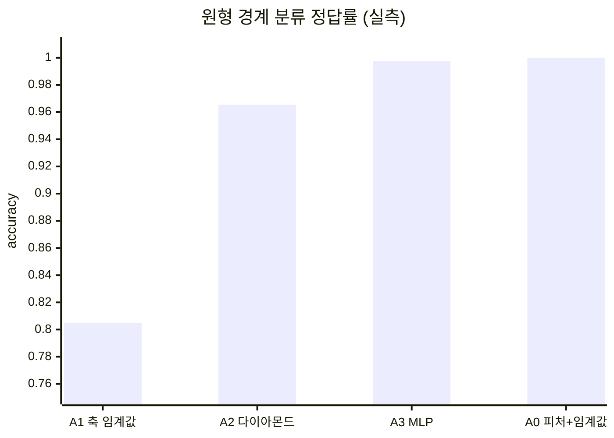

# 01 · 규칙을 '쓴다' vs '배운다' — 결정 경계 실험

> 목적: "AI가 로직을 대신 쓴다"는 말을 **숫자로** 교체한다.
> 선행: 00장. 소요: 25분. 코드: `code/ch01_paradigm.py`

## 1.1 문제 하나를 정합니다

2차평면에 점을 던지고, 원의 안쪽인지 바깥쪽인지 판정하는 문제예요.

```python
label = 1 if (x*x + y*y < 1.0) else 0
```

이 정도면 당신도 10초에 압니다. 반지름 1인 원 안이라는 얘기죠. `if` 한 줄이면 끝이에요.

근데 이 한 줄을 당신이 안 쓰면 어떻게 될까요? 그게 이 장의 실험입니다. 사실 대부분의 AI 문제가
"당신이 10초에 알 수 없는 규칙"이거든요. 불량품 판정, 채팅 의도 분류, 이상 트래픽 탐지처럼요.

그래서 실험은 이렇게 설계했어요. 정답 규칙은 숨긴 채로 데이터, 즉 점 4,000개와 라벨만 줍니다. 그리고
① 사람이 손으로 규칙을 작성하는 편과 ② 모델이 데이터로 학습하는 편, 두 진영을 붙입니다.

```python
import numpy as np

rng = np.random.default_rng(0)
X = rng.uniform(-2, 2, size=(4000, 2)).astype(np.float32)   # [-2,2]² 균일 표본
y = ((X ** 2).sum(1) < 1.0).astype(np.int64)                # 원 안 = 1
print("positive ratio:", y.mean())
```

```text
positive ratio: 0.19525
```

여기서 첫 번째 사실입니다. 정답의 19.5%만 "1"이에요. 바꿔 말하면 아무 생각 없이 전부 "0(바깥)"이라고
답해도 정답률 80.5%는 나온다는 뜻이죠. 이 숫자는 기억해 두세요. 아래의 첫 규칙이 정확히 여기로
수렴합니다.

## 1.2 1라운드: 당신이 if를 쓴다 (축 임계값)

BE 개발자가 가장 먼저 꺼내는 형태예요. 필드 하나를 본 뒤 임계값으로 자르는 것이죠.

```python
best = (0.0, None)
for axis in range(2):                       # x인지 y인지
    for thr in np.linspace(-2, 2, 801):     # 경계값 탐색
        for sign in (1, -1):                # 부등호 방향
            acc = np.mean(((sign * (X[:, axis] > thr)).astype(np.int64) == y))
            if acc > best[0]:
                best = (acc, (axis, float(thr), sign))
print("A1 단순 임계값 최선 acc =", round(best[0], 4), "rule =", best[1])
```

```text
A1 단순 임계값 최선 acc = 0.8048 rule axis/thr/sign = (0, 2.0, 1)
```

나온 값은 `threshold = 2.0`입니다. 표본은 `-2 ~ 2` 범위에서 뽑았으니, 이 규칙은 사실상 "모두 바깥이라고
답하라"로 퇴화했어요. 성의는 없지만 합리적인 답이죠. 0.8048은 위에서 계산한 상식선, 그러니까 80.5%와
일치합니다.

> 이게 00장의 1번 전제가 깨지는 지점입니다. 코드는 `threshold=2.0`을 찾았다고 하지만, 실제로는
> **아무것도 판정하지 않은 것**이 최선이었습니다. 임계값 하나로 원 경계는 표현할 수 없어요.
> 일반 개발에서는 이 실패가 컴파일이나 테스트로 즉시 드러납니다. AI에서는 80%라는 그럴듯한 숫자로 드러납니다.

## 1.3 2라운드: 형태를 맞혀본다 (L1 다이아몬드)

여기서는 조금 도와드리겠습니다. "아, 둥근 모양이었구나" 하고 짐작한 뒤 `|x|+|y| < c` 규칙을 직접 짓는 거예요.

```python
best_d = 0.0
for c in np.linspace(0.1, 4, 800):
    acc = np.mean(((np.abs(X[:, 0]) + np.abs(X[:, 1]) < c).astype(np.int64) == y))
    best_d = max(best_d, acc)
print("A2 |x|+|y|<c 다이아몬드 최선 acc =", round(best_d, 4))
```

```text
A2 |x|+|y|<c 다이아몬드 최선 acc = 0.9655
```

성적이 확 올라갑니다. 80.5%에서 96.6%예요. 손으로 쓴 규칙으로는 여기가 한계입니다. 그리고 남은
3.4%p가 왜 안 줄어드는지를 아는 게, 바로 AI의 실무예요.

- 우리는 진짜 형태(L2: x²+y²) 대신 **비슷한 형태(L1: |x|+|y|)** 를 골랐습니다.
- 사각형의 점 4개가 모인 다이아몬드 꼭지 부근에서 원과 어긋나요. 그 영역이 정답의 약 3.4%입니다.
- `c`를 아무리 정밀하게 탐색해도 이 천장은 뚫리지 않습니다. **파라미터 튜닝으로 형태 오류는 고쳐지지 않습니다.**

> 이 천장을 **편향(bias)** 이라고 부릅니다. 96.6%에서 100%까지의 간극을 줄여주는 추가 자유도는
> 용량(capacity)이라고 하구요. 용어를 새로 외운 게 아니라, 방금 당신이 직접 만든 규칙으로 체감한 겁니다.

## 1.4 3라운드: 형태를 주지 않고 데이터만 준다 (피팅)

여기서 개발자 방식은 내려놔요. 형태를 아예 추측하지 않고, "32칸짜리 조립식 함수"를 던진 뒤 데이터로
채우게 합니다. PyTorch 문법 전부는 04장에서 다루고, 여기서는 골격만 볼게요.

```python
import torch
from sklearn.model_selection import train_test_split
from sklearn.metrics import accuracy_score

torch.manual_seed(0)
Xtr, Xte, ytr, yte = train_test_split(X, y, test_size=0.3, random_state=0, stratify=y)

net = torch.nn.Sequential(
    torch.nn.Linear(2, 32), torch.nn.ReLU(),      # ← 여기서 형태를 '고정'하지 않는다
    torch.nn.Linear(32, 32), torch.nn.ReLU(),
    torch.nn.Linear(32, 2),                       # 2클래스 점수
)
opt = torch.optim.Adam(net.parameters(), lr=0.01)
lossf = torch.nn.CrossEntropyLoss()

Xtr_t, ytr_t, Xte_t, yte_t = map(torch.tensor, (Xtr, ytr, Xte, yte))
for epoch in range(400):
    opt.zero_grad()
    loss = lossf(net(Xtr_t), ytr_t)
    loss.backward()
    opt.step()

net.eval()
with torch.no_grad():
    tr = accuracy_score(ytr, net(Xtr_t).argmax(1).numpy())
    te = accuracy_score(yte, net(Xte_t).argmax(1).numpy())
print(f"A3 MLP train acc = {tr:.4f}  test acc = {te:.4f}")
print("   last loss =", round(loss.item(), 6))
```

```text
A3 MLP train acc = 0.9996  test acc = 0.9975
   last loss = 0.012514
```

여기서 잠깐 멈춰 볼게요. 형태를 전혀 정해주지 않았는데도 점수가 이만큼 나옵니다.

## 1.5 세 라운드를 한 표로

| 라운드 | 누가 판단식을 만들었나 | 정답률 | 실패 모드 |
|--------|------------------------|--------|-----------|
| A1 축 임계값 | **나** (`x > 2.0`) | 0.8048 | 판단력이 0인데 숫자만 그럴듯 |
| A2 다이아몬드 | **나** (형태를 짐작) | 0.9655 | 형태 오차 = 영구 천장 |
| A3 MLP | **데이터** | 0.9975 | 설명 불가, 계산은 함 |

A3가 이긴 이유는 모델이 똑똑해서가 아니에요. A1과 A2는 사람이 틀린 모양을 미리 고정해 버렸고, A3은
어떤 모양인지를 데이터가 결정하게 두었을 뿐입니다. 여기까지가 00장 1번 전제의 증명입니다.

### 그런데 잠깐, A3도 여전히 당신이 고른 것이 있습니다

공짜는 없거든요. A3에서 당신이 손으로 정한 것도 있습니다. 층 수(3), 너비(32), 활성화(ReLU),
lr(0.01), 에포크(400), 그리고 2D 입력을 그대로 준다는 것이죠. 이게 하이퍼파라미터이자
피처 엔지니어링입니다.

- 02장에서 이걸 env var나 config에 대응시켜 놓습니다. 이미 당신이 쓰던 개념이죠.
- A1에서 A2로 간 도약, 그러니까 0.80에서 0.97까지의 공로는 피처를 잘 만든 겁니다. AI가 피처
  엔지니어링을 죽였다는 말은 사실이 아니에요. 이미지를 넣으면 네트워크가 피처를 배우는 곳에서만
  사실입니다(06. CNN).

<!-- diagrams:inserted -->

세 라운드를 표 대신 막대로 보면 설득이 훨씬 덜합니다. 아래가 진짜 증거예요. 마지막 막대 A0은 모델이 필요 없었던 그 경우이고, 값은 `code/ch01_paradigm.py` 실측입니다.



## 1.6 전향자용 결론 3개

1. **"학습이 안 됐다"와 "문제 형태를 잘못 골랐다"를 구분하세요.** 후자는 파라미터 튜닝으로 절대 좋아지지 않습니다(A2의 천장). 일반 개발식으로 말하면, 로직 설계 오류를 설정값으로 덮는 셈이에요.
2. **당신이 규칙을 쓸 수 있는 문제는 AI로 가져가지 마세요.** A1이 0.8048에서 무력했던 건 경계가 둥글어서지, 실력이 부족해서가 아닙니다. 경계가 둥글다는 걸 알았다면 `x*x+y*y<1` 한 줄이면 끝이에요. AI는 경우의 수를 셀 수 없을 때 쓰는 도구입니다.
3. **99.75%의 대가는 설명 가능성입니다.** A2는 "왜 그 점에 1이 나왔는지"를 한 문장으로 말할 수 있어요. A3는 못 합니다. 의료, 대출, 안전 정지 같은 Physical AI 의사결정에서는 이 차이가 기능 요구사항이 됩니다(05장).

## 정리

- 원형 경계 하나에 대해, 손으로 쓴 축 임계값은 **아무 판정도 못 하는 지점(80.5%)** 으로 퇴화한다.
- 형태를 맞힌 손 규칙은 96.6%까지 가지만 **천장이 남는다**(형태 오류 = 편향).
- 데이터에 형태를 맡기면 99.75%. 대신 대가는 설명 불가능이고, 하이퍼파라미터·피처 선택은 여전히 인간 몫이다.

## 직접 해보기

`code/ch01_paradigm.py`를 열어서 아래를 해 보세요.

1. A1 탐색에 축 2개를 **함께** 보는 규칙(`x>y` 같은 2변수 선형)을 추가하면 어디까지 오르나요? 원 경계에 2변수 선형이 여전히 부족하다는 걸 확인하는 과제입니다.
2. `Linear(2, 32)`를 `Linear(2, 2)`로 줄이면 A2 천장 아래로 떨어지나요? 용량과 편향이 갈라지는 것을 직접 관측해 보세요.
3. 정답 규칙을 `x²+y²<1` 대신 `x²-y²<0.2`(쌍곡선)로 바꿔 보세요. 손 규칙은 몇 라운드에서 죽고, 피팅은 몇 라운드에서 죽나요? 여기가 제일 재미있는 지점이에요.

다음: [02. 아는 것으로 시작하기](02_skill_mapping.md) — 방금 마주한 개념들을 이미 당신이 아는 단어로 번역합니다.
