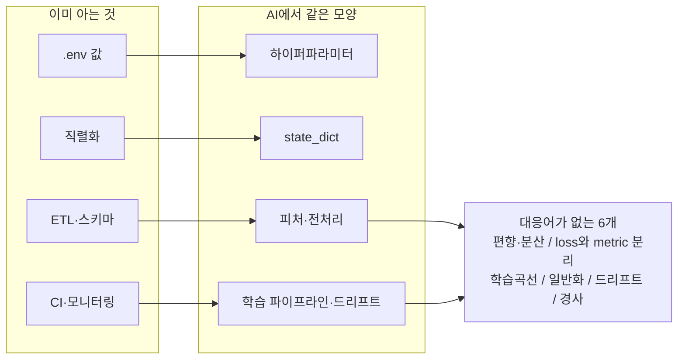

# 02 · 아는 것으로 시작하기 — 개발↔AI 개념 매핑

> 목적: AI 용어를 외우지 말고 **이미 아는 개념에 얹어서** 부르기.
> 선행: 01장. 소요: 20분. 이 장은 사전입니다. 통독보다 끼워 읽으세요.

01장에서 당신은 새 개념을 3개 배운 것 같죠? 사실은 셋 다 이미 부르는 이름이 있는 것들입니다.
`임계값 탐색`은 파라미터 튜닝이고, `형태를 잘못 골라 생긴 천장`은 모델 편향이며,
`점을 더 뽑는 일`은 데이터 수집이에요. 이 장은 그 대응을 표로 고정해 두는 자리입니다.

## 2.1 핵심 대응표

왼쪽 열은 이미 검증된 당신 자산이에요. 오래 봐야 할 곳은 오른쪽 한계 열입니다. 같은 대응이 어디서
깨지는지 그곳만 기억하면, 이 표는 다 읽으신 겁니다.

| 당신이 이미 아는 것 | AI에서 같은 모양의 것 | 한계(여기서 깨진다) |
|---------------------|----------------------|--------------------|
| `.env` / 설정 파일의 값 | **하이퍼파라미터** (lr, batch_size, 층 수) | 코드에 안 박히고 코드를 바꾼다. 값 하나가 발산/수렴을 가름(📕03장) |
| 함수 시그니처 | `forward(x)`의 입출력 **shape** | 타입 검사 대신 shape 검사. `(N,28,28)` vs `(N,784)`가 컴파일 에러 대신 런타임 에러 |
| DTO / 직렬화 | `state_dict` 저장·로드 | 데이터만 저장하고 **코드(클래스)는 별도로 필요**. pickle 전체 저장은 보안 금지 관행 |
| 캐시·DB 커넥션 풀 (프로세스 상주 상태) | **서빙 중인 모델 객체** | 상태가 하나면 안전. GPU/배치 동적합치면 상태가 여러 벌 |
| 스키마 마이그레이션 | **feature schema 변경** | 스키마는 앱이 깨지면 안다. feature는 앱은 멀쩡한 채 **성능만** 깨진다(→드리프트) |
| ETL / 배치 잡 | 데이터 파이프라인·전처리 | 잡은 결정적. 전처리는 **학습 시점의 통계(평균/분산)를 같이 들고 다녀야** 결정적 |
| 단위 테스트 | **검증(val) 집합 평가** | 테스트는 통과/실패 2값. 평가는 0.83이라는 연속값 + 표본 오차 |
| 회귀 테스트 스위트 | 베이스라인 대비 비교 | "이전보다 나빠졌는가"의 판단 기준이 통계를 요구 |
| A/B 테스트 | 모델 버전 비교·캐나리 배포 | 통계검정 감각은 그대로 씀. 승자가 모델이 아니라 **프롬프트**인 경우도 많음 |
| 트래픽 로그·APM 대시보드 | 추론 로깅·입력 분포 모니터링 | 지표를 봐야 잡는 실패라, **안 보면 영원히 모른 채 운영**됨 |
| 롤백 | 이전 체크포인트 재 로드 | 롤백 대상이 코드가 아니라 **가중치 + 전처리 통계** 두 개인 점 |
| 레이턴시 예산 / SLO | 추론 지연 예산 | 06장 실측: 병목이 모델(0.022ms)이 아니라 HTTP 클라이언트 사용법(328.0ms)이었다 |
| 캐시 키 설계 | 입력 feature 해시로 추론 결과 캐싱 | 같은 감각 그대로. AI 시스템에서 가장 값싼 최적화 |
| rate limit / quota | 토큰 과금·GPU 초 과금 | 외부 API 호출 설계 경험이 그대로 재사용 |
| 의존성 버전 고정 (lockfile) | torch/ CUDA 버전 + seed 고정 | 재현성이 "좋으면 좋은 것"이 아니라 **디버깅의 전제** |
| 시드 데이터 / 픽스처 | `manual_seed` + 검증 집합 고정 | 시드를 안 잡으면 리뷰어가 코드를 재현할 수 없음 |
| 정적 해석 / 린터 | shape 검사 도구·`torch.compile` | 자동화가 약한 영역. 손으로 print하던 감각이 여전히 유효 |
| 코드 커버리지 | 데이터 커버리지(클래스·지역·계층별 건수) | 커버리지는 입력을 세는 것. **여기서 가장 많이 죽는다** |
| 로그 레벨 | 학습 로그 간격(`if epoch % 10`) | 과한 로깅이 학습을 늦추는 것도 동일 |
| 배치 워커 / 크론 | 에포크 루프 | 같은 것 같지만 에포크 루프는 **상태가 누적되는** 루프라 비결정적 |
| 레거시 코드 이해 | 사전학습 모델 파인 튜닝 | "모르겠지만 돌아가는 것 고치지 말고 얹기" — 전략이 완전히 동일 |
| 성능 최적화 프로파일링 | 연산자/레이어별 시간·메모리 측정 | 추측 금지, 측정 우선이라는 사고방식이 동일 |

<!-- diagrams:inserted -->

표가 길어서 흐름이 잘 안 보이실 수 있어요. 대응의 생김만 한 장으로 줄여둡니다. 오른쪽으로 갈수록 이미 하던 일이고, 아래로 내려갈수록 새 공부입니다.

## 2.2 대응이 안 되는 것 — 여기가 진짜 새 공부

정직해져 볼게요. 아래는 대응어가 아예 없는 개념들이에요. 표에서 빠진 게 아니라, 당신이 아직
한 번도 안 만난 이름입니다. 두 개는 01장이 이미 보여줬습니다.

1. **편향(bias) vs 분산(variance)**. 01장의 A2 천장이 편향 쪽 사례이고, 05장의 train/val 격차는
   분산 쪽 사례예요. " 모델이 모자란 건가, 데이터를 적게 준 건가 "를 가르는 축인데, 비슷한 개발
   용어가 없어서 제일 헷갈립니다.
2. **손실(loss)과 지표(metric)는 다른 것**이에요. loss는 학습용이라 미분이 가능해야 하고, metric은
   판단용입니다. 그래서 분류 loss가 0.001인데 정확도는 50%인 성적이 실제로 나옵니다. 과적합에
   클래스 불균형이 겹치면요.
3. **학습 곡선**. 성능이 시간의 함수라는 개념이에요. 같은 코드도 "언제 멈추느냐"에 따라 성능이
   달라지거든요. 빌드 시간이 결과에 영향을 준 적이 없으니 개발 쪽에는 대응물이 없습니다.
4. **통계적 일반화**예요. "표본에서 맞았다"와 "전체에서 맞는다"의 간격인데, 테스트로 증명할 수 없고
   확률로만 말할 수 있습니다.
5. **데이터 드리프트**. 배포 후에 입력 분포가 이동해 성능이 저하되는 현상이에요. 코드는 0줄도
   건드리지 않는데 나빠집니다.
6. **경사(gradient)**. 01장 A1이 왜 천장인지 설명하는 유일한 도구입니다. 여기가 진짜 새 수학인데,
   "어딘지 모르게 내리막인 방향" 정도면 충분해요. 깊이는 📕02~03장에서 손으로 해볼 때 가져갑시다.

## 2.3 용어 지도 — 같은 것을 부르는 세 가지 이름

입문 자료를 몇 편만 읽어도 머리가 아파요. 같은 개념에 별명이 셋씩 붙어 있거든요. 누가 잘못 배운
게 아니라, 각 동네에서 먼저 부르던 이름이 한꺼번에 몰려온 겁니다. 이 책에서 쓸 이름은 아래와 같이
정리했습니다.

| 하나의 실제 | 자료 A가 쓰는 말 | 자료 B가 쓰는 말 | 이 책 |
|-------------|-----------------|-----------------|-------|
| 학습 대상 숫자 묶음 | 가중치 weight | 파라미터 parameter | 파라미터 |
| 사람이 고치는 값 | 하이퍼파라미터 | 설정 config / knob | 하이퍼파라미터 |
| `ŷ와 y의 차이` | 손실 loss | 비용 cost / 오차 error | 손실 |
| 데이터 조각 | 샘플 sample | 관측치 instance / 예시 example | 샘플 |
| 전체를 몇 번 봄 | epoch | pass | 에포크 |
| 한 번에 뭉치 | batch | mini-batch | 배치 |
| 예측의 정답률 | accuracy | score | 정확도 |
| unseen 데이터 | test set | hold-out / OOD | 검증 집합 |
| 모델 저장물 | checkpoint | artifact / state_dict | 체크포인트 |
| 잘못된 예측에 대한 벌점 | 페널티 | 규제 regularization / weight decay | 규제 |

## 2.4 전향자가 가장 많이 헷갈리는 두 쌍

- **"학습(learning)" vs "추론(inference)"**예요. 학습은 훈련장에서만 하는 비싸고 느린 배치 잡이고,
  추론은 서빙에서 늘 하는 싸고 빠른 단일 계산입니다. 모델을 load하는 행위는 추론이지 학습이
  아니에요. 가중치가 갱신되지 않으면 학습이 아닙니다. `eval()` + `no_grad()`는 그 사실을 선언하는
  코드이고요.
- **" fitting" vs "testing"**은 더 즉각적입니다. test에 모델을 대는 그 순간 test는 val이 돼요.
  점수는 그대로인데 의미만 사라지죠. 03장·05장의 데이터 누수가 전부 여기서 발생합니다.

## 정리

표는 외우려 하지 마세요. 필요할 때 이 장으로 돌아와 짚으면 됩니다. 사전은 정독하는 물건이 아니잖아요.

- AI에서 낯선 것은 **약 20%이고 80%는 이름만 다른 당신 아는 것**입니다. 대응표가 있으면 공부량이 5분의 1로 줄어듭니다.
- 대응이 안 되는 6개(편향·분산, loss≠metric, 학습곡선, 일반화, 드리프트, 경사)가 진짜 새 학습 대상입니다.
- 용어 별명 표와 "학습 vs 추론" 구분만 먼저 고정해 두세요. 안 하면 문서·강의·코드가 계속 갈립니다.

## 직접 해보기

1. 지금 참여 중인 서비스의 **`.env`에 있는 값 중 하나**를 고르세요. "이 값이 코드의 어느 동작을 바꾸는가?"에 대응하는 AI 개념이 위 표의 어디쯤인지 찾아보시면 됩니다.
2. 당신의 서비스에서 **스키마 마이그레이션**을 했던 경험 하나를 떠올려 보세요. 그게 "feature schema 변경"으로 오면 어떤 대 재해가 벌어질지 미리 예측해 보는 겁니다(정답은 05장·드리프트).
3. 이 표에 없는 대응을 하나 찾아보세요. 있으면 저에게 알려주세요. 다음 판에는 표에 얹어 두겠습니다.

다음: [03. 데이터가 곧 코드다](03_data.md) — 01장의 A1 실패가 사실상 여기서도 재발합니다.
