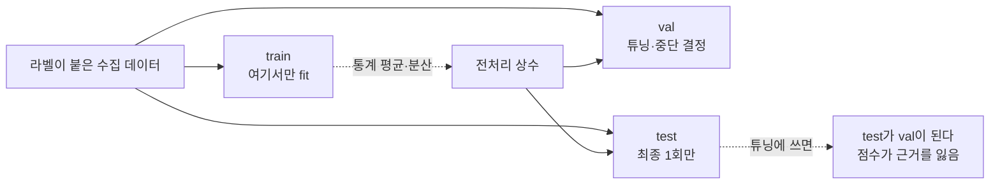
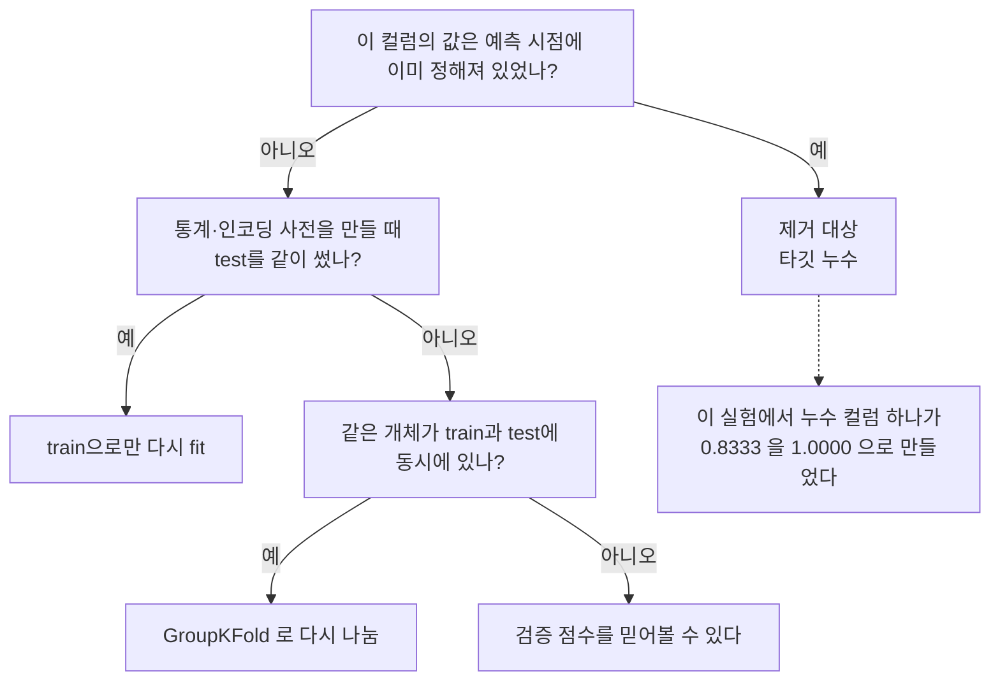

# 03 · 데이터가 곧 코드다

> 목적: AI에서 "로직을 작성하는 행위"가 실제로 무엇인지 확인한다. 답은 **데이터 설계**다.
> 선행: 01·02장. 소요: 30분. 코드: `code/ch05_traps.py`(누수 실험 포함)

## 3.1 01장의 실패를 다시 보면 원인은 데이터였다

01장에서 축 임계값 규칙은 0.8048 앞에서 힘을 못 썼죠. 그때 우리는 "모양이 둥글어서"라고
설명했습니다. 틀린 말은 아닌데, 좀 빗나갔어요. 더 정확히는 이렇습니다:

> **판단식을 만든 사람의 문제가 아니라, 판단에 필요한 정보가 입력에 없어서** 실패했다.

`x` 하나로는, `x>thr`와 `y>thr` 두 개를 묶어도 원을 표현할 수 없습니다. 그런데 `x²+y²` 라는
피처를 주면 임계값 하나(`= 1.0`)로 100% 맞습니다. 차이가 여기서 갈려요:

| 접근 | 한 일 | 결과 |
|------|-------|------|
| A1 | 입력 2개에서 임계값 탐색 | 0.8048 (판단력 없음) |
| A2 | 입력 2개에서 다른 형태 탐색 | 0.9655 (형태 천장) |
| **A0** | **피처를 `x²+y²`로 만들어 주면** | **1.0000, 규칙 한 줄** |

A0이 이 표에 없던 이유는 단순합니다. 01장이 "피처를 만드는 일"을 애초에 배제하고 시작했거든요.
그런데 AI 실무에서 가장 먼저 해야 하는 게 바로 이 A0입니다. 모델을 고르는 얘기가 아니라,
데이터를 설계하는 얘기예요.

> **전향자용 요약**: "모델을 고른다"고 말하는 시간의 대부분은 사실 "입력에 어떤 정보를 담을지"를
> 고르는 시간입니다. 그리고 그건 당신이 이미 하는 **API 응답 스키마 설계**와 같은 종류의 작업입니다.

## 3.2 라벨 — "정답"이라는 테이블 컬럼

지도학습은 `(입력, 정답) 쌍`이 있어야 성립합니다. 이 정답을 라벨이라고 불러요.

DB 설계 감각으로 번역하면 오히려 더 또렷해집니다:

```sql
-- labeled_samples
--  features: jsonb      label: int     labeled_at: timestamptz   labeler: text
```

결국 정의해야 할 것은 질문 3개가 전부입니다:
1. **정답이 이미 존재하는가?** 로그·DB·이력 안에 이미 들어 있는 경우가 많습니다. 라벨링은 *생산*이
   아니라 *추출*인 일이 잦거든요. "고객이 재문의했으면 미해결"로 기준만 잡으면 라벨은 이미 통화
   이력에 있습니다.
2. **정답이 생긴 시점이 예측 시점보다 나중은 아닌가?** 이 질문이 데려가는 데가 3.4의 누수예요.
3. **클래스 분포는 어떤가?** 05장의 정확도 역설로 이어지는 질문입니다. 실측으로
   `positive ratio: 0.19525`였던 01장을 기억해 주세요.

### Physical AI 관점의 라벨

| 태스크 | 라벨 출처 | 주의 |
|--------|-----------|------|
| 불량품 판정 | 기존 검사 결과 / 폐기 이력 | 검사원의 기준 변화가 라벨 노이즈 |
| 물체 인식 | 사람이 박스 그림 | 레이어(그림자·가리임) 구분 실패가 최다 오류 |
| 충돌 방지 | 사건/임박 타임스탬프 | **극단히 불균형**(05장) + 드물어 표본 부족 |
| grasp 성공 | 로봇이 직접 시도한 결과 기록 | 실패 시도를 안 남기면 편향 데이터가 됨 |

표에서는 마지막 행을 한 번 더 봐 주세요. 성공 시도만 로그로 남기는 시스템은 모델에게 "세상엔 실패가
없다"고 가르치는 구조입니다. 이건 버그가 아니라 스키마 설계 실패예요. 로깅 정책은 정했는데 모델의
세계관까지 같이 정해지고 있다는 걸 몰랐던, 그런 경우입니다.

## 3.3 스플릿 — 같은 데이터를 두 번 보면 안 되는 이유

여기서는 조금 낯선 규율이 나옵니다. 일반 개발에는 "테스트에 쓴 입력을 프로덕션에서도 쓰는 것"을
막는 장치가 없거든요. 아무도 안 막습니다. AI에서는 이게 필수 규율이에요.

```python
import numpy as np
from sklearn.model_selection import train_test_split

rng = np.random.default_rng(0)
X = rng.uniform(-2, 2, size=(4000, 2)).astype(np.float32)
y = ((X ** 2).sum(1) < 1.0).astype(np.int64)

Xtr, Xte, ytr, yte = train_test_split(
    X, y, test_size=0.3, random_state=0, stratify=y   # stratify = 층화 추출
)
print("train/test:", Xtr.shape, Xte.shape)
print("positive ratio:", round(float(ytr.mean()), 5), round(float(yte.mean()), 5))
```

```text
train/test: (2800, 2) (1200, 2)
positive ratio: 0.195 0.1959167
```

- 왜 층화(`stratify`)를 걸었는지가 첫 번째입니다. 클래스가 19.5%뿐인데 랜덤으로 나누면 한쪽에 정답이
  몰릴 수 있어요. 층화는 "비율을 양쪽에 유지"하는 일이고, DB로 치면 `ORDER BY label` 하고 나서
  분할하지 않는 것에 가깝습니다.
- `random_state=0`은 스플릿을 고정하는 값이에요. 이게 없으면 실행마다 val 점수가 달라져서 코드
  변경의 효과와 샘플링 요행을 구분할 수 없습니다. 재현성은 있으면 좋은 것이 아니라 디버깅의 전제죠.
- 01장에서 검증 집합 `test acc`를 보고 "0.9975"라고 자신 있게 말한 근거가 이 30%입니다.

### 데이터셋은 보통 세 갈래

```text
train (맞추는 데 사용)  |  val (튜닝·중단 결정)  |  test (최종 1회만)
```

test를 튜닝에 쓰는 순간에 무슨 일이 벌어지는지 볼게요. 그 test는 val이 되고, 최종 점수는 근거를
잃습니다. 도덕의 문제가 아니라 숫자의 의미가 사라지는 기술적 문제예요. 결과는 늘 한 방향으로
나옵니다. 배포 후 성능이 검증 점수보다 항상 낮게 나온다는 뜻입니다.

<!-- diagrams:inserted -->

스플릿이 왜 미덕이 아니라 규율인지 그림 하나로 정리해둡니다. 아래 점선이 건너지 않으면 사고가 나는 선이에요.



## 3.4 누수(leakage) — 성적이 너무 좋은 게 이상하다

여기가 이 책의 핵심 실측입니다. 고객 이탈(churn) 예측을 하나 만들어 볼게요. 컬럼은 이렇게 잡았어요.

- `usage`: 사용량입니다. 이탈과 약한 관계가 있고, 진짜 예측 인과가 이쪽에 있죠.
- `cancel_calls`: 해지 문의 횟수예요. …어, 잠깐만요. 해지를 문의한 사람은 이미 이탈을 결심한
  사람이잖아요.

```python
import numpy as np
from sklearn.linear_model import LogisticRegression
from sklearn.metrics import accuracy_score
from sklearn.model_selection import train_test_split

rng = np.random.default_rng(0)
N = 3000
churn = (rng.random(N) < 0.2).astype(int)               # 20% 이탈
usage = rng.normal(0, 1, N) - churn * 1.2               # 이탈과 상관 있는 정상 피처
# leak: '해지 문의'는 사실상 라벨 이후에만 존재하는 정보
cancel_calls = np.where(churn == 1, rng.integers(2, 6, N),
                        rng.integers(0, 2, N)).astype(float)

feat_good = np.column_stack([usage, rng.normal(0, 1, N), rng.normal(0, 1, N)])
feat_leak = np.column_stack([usage, cancel_calls])

for name, F in (("정상(사용량만)", feat_good), ("누수(+해지문의)", feat_leak)):
    Xtr_, Xte_, ytr_, yte_ = train_test_split(F, churn, test_size=0.3,
                                              random_state=0, stratify=churn)
    mdl = LogisticRegression(max_iter=1000).fit(Xtr_, ytr_)
    baseline = max(np.bincount(yte_)) / len(yte_)      # 항상-다수클래스 상수함수
    print(f"{name:<16} train acc={accuracy_score(ytr_, mdl.predict(Xtr_)):.4f}"
          f"  test acc={accuracy_score(yte_, mdl.predict(Xte_)):.4f}"
          f"  (항상-기준선 {baseline:.4f})")
```

```text
정상(사용량만)         train acc=0.8367  test acc=0.8333  (항상-기준선 0.8022)
누수(+해지문의)        train acc=1.0000  test acc=1.0000  (항상-기준선 0.8022)
```

`test acc = 1.0000`입니다. 스택트레이스도 없이, 경고도 없이, 에러 코드도 없이 이 숫자가 나옵니다.
성적표로 이렇게 예쁜 것도 드물죠. 그런데 당신이 팀에 "이탈 예측 100% 나갔습니다"라고 보고하는 순간,
사고는 확정됩니다.

왜 사고인지도 말씀드릴게요. 서비스 시점에 `cancel_calls`는 아직 존재하지 않는 값이거든요. 예측하려고
하는 바로 그 시점보다 나중의 정보니까요. 그래서 이 모델은 배포되면 입력 컬럼이 비었거나 0으로
채워져서 아무 쓸모가 없습니다. 그런데 검증에서는 정답이 입력 안에 그대로 들어 있었으니 100%였죠.

> **전향자용 번역**: 이건 **단위 테스트의 입력에 기대 출력 값을 섞어 넣은 것**과 정확히 같은 실수입니다.
> `assert calculate_refund(order, expected_refund_amount)` 식의 테스트를 본 적 있나요?
> 통과합니다. 아무것도 검증하지 않습니다. AI에서 그 컬럼 하나가 `test acc 1.0`을 만듭니다.

### 누수를 잡는 질문 3개 (코드 리뷰처럼)

리뷰 때 이 세 개만 찍어보면 됩니다.

1. **이 컬럼의 값은 "예측 시점"에 이미 정해져 있었나?** 가장 흔한 살인마가 이 질문이에요.
2. 이 컬럼의 통계를 만들 때 **평균·분산·인코딩 사전을 test와 같이 썼나?** 전처리·스케일링에서 새는
   누수입니다.
3. 같은 개체, 예를 들어 고객이나 로봇 개체나 센서 세션이 train과 test에 동시에 있나? 그룹 누수라면
   `GroupKFold`로 막습니다. 01장 실험은 개별 점이 독립이라 안 걸리지만, 실제 센서 데이터에서는 같은
   세션의 연속 프레임이 train과 test 양쪽에 빠져서 점수가 부풀려져요.

2번은 놓치기 쉬워요. 스케일링만으로는 점수가 안 움직이는 경우가 많아서 재현이 미묘하거든요.
사고의 90%는 1번과 3번에서 납니다.

## 3.5 전처리도 "코드"다 — 통계는 함께 보관

`StandardScaler`를 학습 데이터로 fit 했다면, 그 평균과 분산을 모델 가중치와 함께 저장해야 합니다.
여기서 멈추면 안 돼요. 아래처럼 값을 꺼내 두는 데까지가 전처리입니다.

```python
from sklearn.preprocessing import StandardScaler
import torch

scaler = StandardScaler().fit(Xtr)            # train으로만 fit (핵심)
mu, sd = scaler.mean_, scaler.scale_          # ← state_dict와 함께 보관해야 하는 값
Xte_t = (torch.tensor(Xte) - torch.tensor(mu)) / torch.tensor(sd)   # test는 transform만
```

배포할 때 "서버가 알아서 정규화해주겠지"는 없습니다. 그런 기본값은 어디에도 없어요. 가중치와
전처리 상수가 한 세트로 굴러가는 구조를 당신이 설계해야 합니다. 그 이야기를 06장에서 다룹니다.

3.4의 사고를 배포 전에 잡아내는 질문 세 개를 이 순서로 돌리면 됩니다. 하나라도 걸리면 그
컬럼은 입력에서 빼버리세요.



## 정리

- AI에서 로직을 작성하는 일은 곧 데이터 설계입니다. 피처 하나(`x²+y²`)가 규칙 한 줄로 1.0000을
  만들고, 없는 정보로는 임계값이 0.8048까지 퇴화합니다.
- 라벨은 대부분 생산이 아니라 기존 이력의 추출입니다. BE 경력자의 강점이 그대로 살아나는 지점이에요.
- 스플릿은 규율입니다. `stratify`와 `random_state`를 걸고, test는 최종 1회만 씁니다.
- 성적이 너무 좋으면 의심하십시오. `test acc 1.0000`은 성공이 아니라 정답이 새었다는 신호입니다.
- 전처리 통계는 가중치와 한 세트로 배포됩니다.

## 직접 해보기

`code/ch05_traps.py`:
1. 3.4의 `cancel_calls`를 `rng.integers(0,2,N)`(라벨과 무관)로 바꿔 보세요. test acc가 몇으로 내려가는지 확인하시면 됩니다. 컬럼 하나가 0.83 ↔ 1.00을 만드는 걸 눈으로 보시는 거예요.
2. 현재 당신의 서비스에서 "예측 시점에 존재하지 않을 컬럼"을 하나 찾아보세요. 생성 타임스탬프가 라벨 발생보다 나중인 것이면 됩니다.
3. 층화 없이 `stratify=None`으로 20번 돌려 보고 val acc가 얼마나 흔들리는지 측정해 보세요. 표본 오차 감각이 이쯤에서 붙습니다.

다음: [04. 모델 = 상태가 있는 함수](04_model.md) — 00장 3번 전제("입력이 같으면 출력도 같다")가
실제로 어떻게 깨지는지 실측으로 봅니다.
