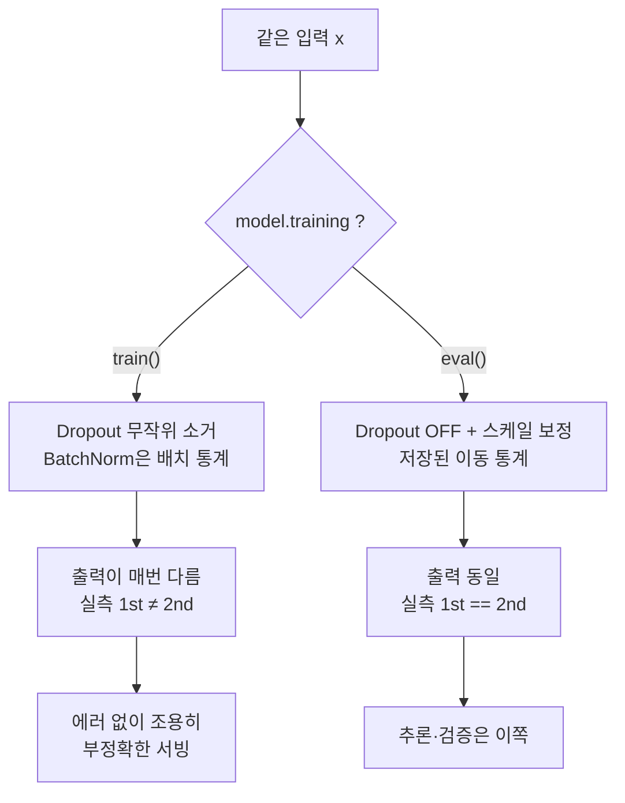

# 04 · 모델 = 상태가 있는 함수

> 목적: 00장 2·3번 전제("로직은 상태가 없다", "입력 같으면 출력 같다")가
> 실제로 어떻게 깨지는지 눈으로 확인한다.
> 선행: 01~03장, 📕04장(nn.Module 문법). 소요: 25분. 코드: `code/ch04_state.py`

## 4.1 모델은 전역 상태다 — 규모만 빼고

`nn.Module` 인스턴스를 하나 떠올려 보세요. 개발 쪽에서 가장 가까운 기존 개념이 뭘까요?

```python
class Config:                 # process-wide mutable state
    ...
```

아직 아니에요. 살짝 더 가까이 가 볼게요.

```python
# 프로세스 생명주기 동안 살아있고, 갱신되고, 외부에서 주입되고,
# 읽는 순간 결과가 달라질 수 있는 전역 상태
weights: dict[str, Tensor] = {...}     # 학습 중에는 계속 쓰여진다
```

즉 모델은 **"함수 형태 + 100만 개짜리 상태 묶음"** 입니다. 함수는 껍데기이고, 상태가 내용이에요.
그래서 `model.state_dict()`을 저장하는 거고, 그건 함수를 저장하는 게 아니라 상태 스냅샷을 저장하는
일입니다. 직렬화 대상이 데이터라는 점은 당신이 아는 그대로예요.

| 개발 개념 | 대응 | 비고 |
|-----------|------|------|
| 클래스 정의(`class`) | `nn.Module` 서브클래스의 `forward` | 코드. git에 들어감 |
| 인스턴스 필드값 | `state_dict` | 데이터. git에 들어가지 않음(수 MB~수 GB) |
| `new` / DI 컨테이너 | 생성 + `load_state_dict()` | **두 단계가 분리**되어 있다는 게 중요 |
| 직렬화/역직렬화 | `torch.save` / `torch.load` | 클래스는 따로, 값은 따로 |

> 그래서 "모델을 배포한다"는 건 **두 개의 서로 다른 산출물을 같은 버전으로 짝 맞춰 올리는 일**입니다.
> 코드(아키텍처)와 가중치(체크포인트)가 어긋나면 로드 자체가 실패하거나, 더 나쁘게는
> shape은 맞는데 의미가 다른 값을 얹어 아무 오류 없이 틀린 답을 냅니다. **마이그레이션 문제와 동일**합니다.

## 4.2 같은 입력, 다른 출력 — 실측

이 부분이 00장 3번 전제를 정확히 부숩니다. `Dropout`이라는 층이 있어요. "학습 중에는 뉴런을 무작위로
끄는" 층이죠. 이 층이 하나 들어가면 모델은 입력이 같아도 출력이 다릅니다.

```python
import torch

torch.manual_seed(0)
net = torch.nn.Sequential(
    torch.nn.Linear(4, 16), torch.nn.Dropout(0.5), torch.nn.Linear(16, 2)
)
x = torch.tensor([[1.0, 2.0, 3.0, 4.0]])

net.train()                       # 학습 모드
a1, a2 = net(x).flatten(), net(x).flatten()
print("train() 1st:", [round(v, 4) for v in a1.tolist()])
print("train() 2nd:", [round(v, 4) for v in a2.tolist()], "-> 다른가?", bool((a1 != a2).any()))

net.eval()                        # 추론 모드
b1, b2 = net(x).flatten(), net(x).flatten()
print("eval()  1st:", [round(v, 4) for v in b1.tolist()])
print("eval()  2nd:", [round(v, 4) for v in b2.tolist()], "-> 같은가?", bool((b1 == b2).all()))
```

```text
train() 1st: [-0.7894, 1.9348]
train() 2nd: [0.7884, 3.933] -> 다른가? True
eval()  1st: [1.2292, 1.7988]
eval()  2nd: [1.2292, 1.7988] -> 같은가? True
```

`train()`에서는 두 호출의 출력이 완전히 다릅니다. 같은 가중치에 같은 입력을 줬는데도요.
`eval()`에서는 동일하고요. …이상하죠? "입력 같으면 출력 같다"는, 우리가 전제로 깔아 둔 그
이야기인데 말이에요.

<!-- diagrams:inserted -->

위 실측을 모드 스위치 하나로 정리하면 이렇습니다. 같은 입력이 갈리는 지점이 바로 여기예요.



### 이게 왜 존재하는가

왜 이렇게까지 하나 싶죠? Dropout은 일부 뉴런을 꺼서 모델이 특정 뉴런에 과의존하는 것을 막는 학습
규제입니다. 그 무작위성은 학습 중에만 의미가 있고, 추론에서는 있으면 안 돼요. 그래서 층이 스스로
모드에 따라 동작을 바꿉니다.

- `train()`: 무작위 비활성화 ON. 학습의 일부입니다.
- `eval()`: 무작위 비활성화 OFF에 스케일 보정까지. 추론의 일부예요.
- `Dropout`만의 일도 아닙니다. BatchNorm도 학습 시에는 배치 통계를 쓰고, 추론 시에는 저장된 이동
  통계를 씁니다.

### 그래서 발생하는 실제 사고 3가지

1. 추론을 `train()` 모드에서 돌리는 사고입니다. 결과가 매번 다르고 부정확한데, 에러는 안 남아요.
2. `eval()`을 안 하고 `backward()`를 돌리는 경우요. 평가 지점이 흔들려서 학습 곡선을 해석할 수
   없습니다.
3. `model.eval()`을 잊고 지표를 보고하는 케이스죠. "배포 전 검증 0.91이었는데 실제론 0.74"라는
   가장 고전적인 원인이 여기 있습니다.

세 가지에 공통으로 없는 게 있습니다. 에러 메시지예요. 그래서 아래 코드는 생략하면 안 됩니다.

```python
model.eval()          # 검증·추론 직전, 반드시
with torch.no_grad(): # 기울기 추적도 끈다 (메모리·속도)
    logits = model(x)
```

> 📕02·05장에서 `no_grad()`와 `eval()`을 각각 봤습니다. 이 장에서는 그 두 개가
> **"상태가 있는 객체의 모드 스위치"** 라는 하나의 주제로 합쳐집니다.

## 4.3 5단계 루프를 개발 프로세스로 읽기

📕04장에서 이미 한 번 본 그 학습 루프예요. 지금은 렌즈만 바꿔서 봐 볼게요.

```python
for epoch in range(N):
    for xb, yb in dl:
        optimizer.zero_grad()      # ① 이전 run의 잔여 상태 제거
        out  = model(xb)           # ② 현재 상태로 계산
        loss = criterion(out, yb)  # ③ 결과를 기대값과 비교  ← 회고/테스트 판정
        loss.backward()            # ④ 무엇이 얼마나 문제였나 원인 계산
        optimizer.step()           # ⑤ 상태를 갱신            ← 실제 패치
```

| 단계 | 대응하는 개발 행위 |
|------|-------------------|
| ① `zero_grad()` | 전역 상태 초기화(**테스트 격리**). 안 하면 이전 테스트의 잔상이 누적됨 |
| ② `model(xb)` | 함수 호출. 아직 상태는 그대로 (side effect 없음) |
| ③ `criterion(...)` | **기대와 실제의 diff** 계산 |
| ④ `backward()` | diff를 **각 원인의 기여도로 분해** (credit assignment) |
| ⑤ `step()` | 원인을 반영해 **상태를 패치** |

④가 왜 하필 미분인지도 이 관점으로 읽히면 편합니다. diff를 각 파라미터의 기여도로 나누는 작업은
결국 변화의 1차 근사, 즉 기울기를 요구하거든요. ④는 일반 개발로 치면 프로파일링이자 원인 분석에
해당해요. 그래서 ⑤의 패치보다 훨씬 비싸고, 학습이 느린 이유도 바로 이것입니다.

> **핵심 재해석**: 학습 루프는 "계속 재시도하는 무식한 반복"이 아니라
> `실행 → diff 계산 → 원인 분해 → 상태 패치`를 데이터 규모만큼 반복하는 **자동화된 디버깅 루프**입니다.
> 당신이 매일 하는 일의 자동화이지, 새 일이 아닙니다.

## 4.4 그럼에도, 모델은 stateless로 만들어야 하는 것

이제 실전 규칙이에요. 아래를 지키면 00장 2번 전제를 되찾아올 수 있습니다.

- **추론 API에서는 절대 갱신하지 마세요.** `optimizer.step()`이 없어야 합니다. 가중치가 달라지는
  순간 그 서비스는 학습 중인 것이지, 추론 중인 게 아니에요.
- **동일 가중치를 모든 워커가 공유**하게 하세요. 모델 load는 프로세스 시작 시 1회면 충분합니다.
  워커마다 가중치가 다르면 같은 요청에 다른 답이 나오거든요. 캐시 오염과 같은 종류의 사고예요.
- **버전을 응답에 담으세요.** `/predict` 응답에 `model_version`을 넣는 순간 디버깅 가능성이
  달라집니다. 새 기술이 아니라 순수한 API 설계 감각이죠.
- **상태 변경은 배치 잡으로 분리**하세요. "학습"과 "추론"은 프로세스도, 스케일도, SLO도 서로
  다른 일이니까요.

이 4개를 지키면 비로소 AI 서비스가 당신의 표준 운영 감각으로 관리 가능합니다. 그 경계를 실제로
코드로 긋는 이야기는 06장에서 합니다.

## 정리

이 장은 실측으로 확인한 것만 정리했습니다.

1. 모델은 **함수 형태(코드) + 파라미터(상태)** 의 짝이다. 배포는 두 산출물의 버전 맞춤이다.
2. `train()` 모드에서는 같은 입력이라도 출력이 다를 수 있다(실측). `eval()` + `no_grad()`로 결정화한다.
3. 5단계 학습 루프는 **실행 → diff → 원인 분해 → 상태 패치**, 즉 자동화된 디버깅 루프다.
4. 그래도 서빙에서는 stateless처럼 굴도록 설계하는 게 실전이다(갱신 금지·가중치 공유·버전 명시).

## 직접 해보기

`code/ch04_state.py`:
1. `net.eval()`을 빼고 추론을 100번 돌려 보세요. 출력 분산이 얼마나 벌어지는지, "에러 없는 이상함"을 직접 목격하시는 과제입니다.
2. `Dropout`을 없애면 train과 eval의 출력이 같아지나요? BatchNorm을 넣으면 어떤 게 달라지나요?
3. 서로 다른 `Linear` 클래스 정의를 두 개 만들고, 한쪽 `state_dict`를 다른 쪽에 로드하면 무엇이 벌어지는지 보세요. 4.1에서 말씀드린 짝 어긋남 사고입니다.

다음: [05. 지표의 함정](05_eval.md) — 00장 5번 전제("버그는 트레이스를 남긴다")를 무너뜨리는 실측 3종.
