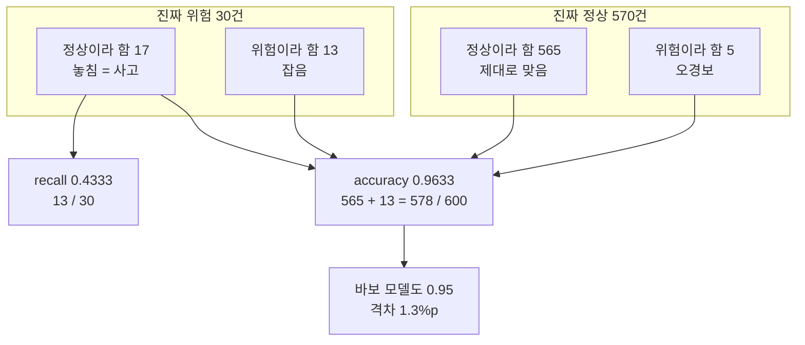
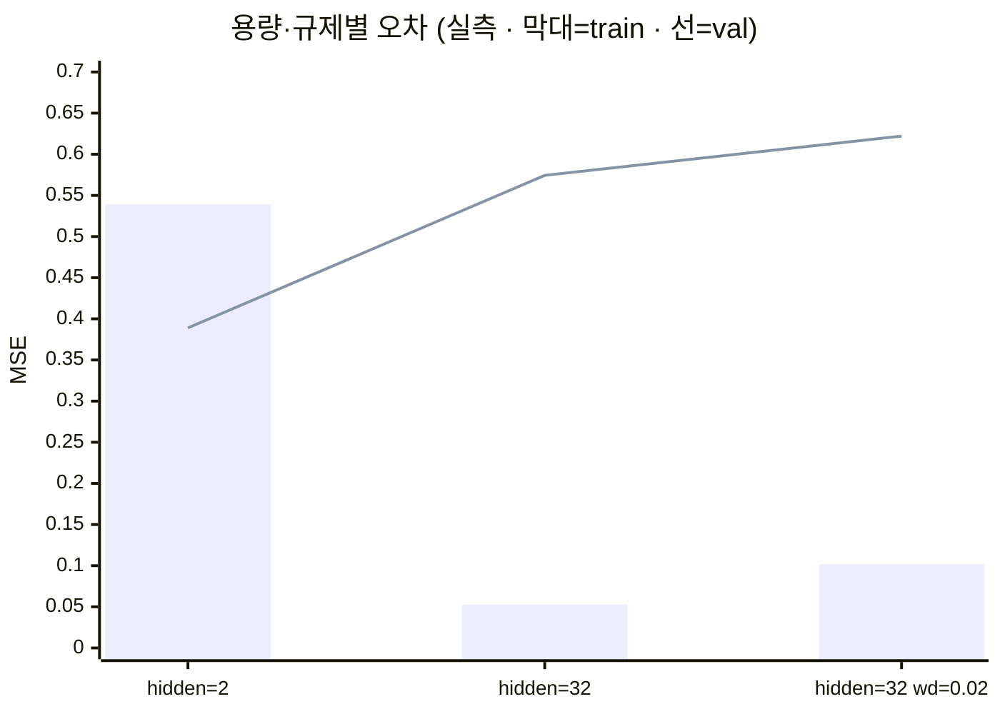

# 05 · 지표의 함정 — 직관이 꺾이는 세 지점

> 목적: 00장 5번 전제("버그는 스택트레이스를 남긴다")가 AI에서 성립하지 않음을 실측으로 보인다.
> 선행: 03장. 소요: 35분. **이 책에서 가장 중요한 장.** 코드: `code/ch05_traps.py`

일반 개발에서는 "동작하는데 잘못됐다"는 상황이 좀처럼 안 나옵니다. 틀리면 예외가 나거나 500이 뜨거나,
최소한 로그에는 남거든요. AI는 여기서 갈립니다. 아무 예외 없이, 성공적으로, 틀린 답이 운영됩니다.
이 장에서는 그 경로를 세 갈래로 나눠서 직접 재볼게요.

## 5.1 함정 ① — 정확도 0.963인데 모델을 버려야 하는 경우

"이메일 스팸"처럼 드문 Positive를 찾는 문제를 상상해 보세요. 2,000건 중에 이탈·위험이 5%뿐인 상황이죠.
나머지는 전부 정상입니다. 이런 데이터에서 정확도는 우리가 알던 얼굴이 아닙니다.

```python
import numpy as np
from sklearn.linear_model import LogisticRegression
from sklearn.metrics import (accuracy_score, balanced_accuracy_score,
                             confusion_matrix)
from sklearn.model_selection import train_test_split

rng = np.random.default_rng(0)
X = np.vstack([rng.normal(-0.4, 1.2, (1900, 3)),     # 다수 클래스 (정상)
               rng.normal(1.2, 1.2, (100, 3))])       # 소수 클래스 (위험)
y = np.r_[np.zeros(1900, int), np.ones(100, int)]

Xtr, Xte, ytr, yte = train_test_split(X, y, test_size=0.3, random_state=0, stratify=y)
mdl = LogisticRegression(max_iter=1000).fit(Xtr, ytr)
pred = mdl.predict(Xte)

print(f"positives in test: {int(yte.sum())} / {len(yte)} ({yte.mean():.1%})")
print("model accuracy         =", round(accuracy_score(yte, pred), 4))
print("trivial 'always 0' acc =", round(accuracy_score(yte, np.zeros_like(yte)), 4))
print("balanced accuracy      =", round(balanced_accuracy_score(yte, pred), 4))
print(confusion_matrix(yte, pred))
```

```text
positives in test: 30 / 600 (5.0%)
model accuracy         = 0.9633
trivial 'always 0' acc = 0.95
balanced accuracy      = 0.7123
confusion matrix (rows=true 0/1):
[[565   5]
 [ 17  13]]
minority recall = 0.4333   precision = 0.7222
```

실행이 끝났으니 이 다섯 개 숫자를 위에서 아래로 차근차근 읽어볼게요. 00장 5번 전제가 바로 여기서
무너집니다.

- `5.0%`. 600건 중에 진짜 Positive는 **30건**에 지나지 않아요. 나머지는 전부 정상입니다.
- `model accuracy 0.9633`. 보고서에 넣기 딱 좋은 숫자죠. 대부분 이대로 통과됩니다.
- `trivial 'always 0' acc 0.95`. 여기까지가 문제예요. "무조건 정상입니다"라고 답하는 하드코딩된 바보
  모델이 0.95입니다. 학습시킨 모델과의 차이는 1.33%p뿐이에요. 30건의 위험 중 17건을 놓쳤는데 그
  대가가 1.3%p입니다. 표정이 조금 달라지실 거예요.
- `balanced accuracy 0.7123`. 클래스별로 정확도를 평균한 값이에요. 0.963과 0.712 사이에 이렇게 틈이
  벌어지는 것, 그게 바로 불균형의 실체입니다.
- `recall 0.4333`. **진짜 위험한 것의 43%만 잡았습니다.** 17건은 "정상" 판정을 받고 그대로 통과했어요.

> **전향자용 결론**: `accuracy`는 불균형 데이터에서 **의미가 없는 숫자**입니다.
> "무조건 정상"이라고 답하는 상수 함수와 비교해서 이긴 만큼만 실력입니다.
> 이 비교(`trivial baseline`)를 하지 않은 AI 성과 보고는 보고가 아닙니다.

<!-- diagrams:inserted -->

정확도라는 숫자 하나가 어떻게 네 갈래로 흩어지는지 보면, 왜 이 표를 읽어야 하는지 저절로 보이실 겁니다. 안의 숫자는 위 실행 결과 그대로예요.



### 그럼 무엇을 봐야 할까요

| 지표 | 언제 | 이 실험값 |
|------|------|-----------|
| accuracy | 클래스 균형일 때만 | 0.9633 ← 무의미 |
| **항상-0 기준선** | 불균형이면 먼저 계산 | 0.95 ← 모델과 1.33%p차 |
| balanced accuracy | 불균형 기본값 | 0.7123 |
| **recall(재현율)** | **놓치면 위험한 쪽** | 0.4333 ← 17건 놓침 |
| precision(정밀도) | 오경보 비용 큰 쪽 | 0.7222 |
| F1 | 정밀/재현 균형 필요 | (계산 가능) |
| confusion matrix | 위 모두의 원천 | 565/5/17/13 |
| PR-AUC / ROC-AUC | 순위 품질 + 임계값 결정 | — |

비용이 비대칭이면 지표를 평균 내면 안 됩니다. "위험 100건 중 17건을 놓침"과 "정상 570건 중 5건을
오경보"는 서로 다른 비용이거든요. 둘 다 숫자로는 볼 만해 보이지만 회사에 남는 흔적이 다릅니다.
어떤 오류가 더 나쁜지를 먼저 정하고, 그 오류를 최소화하는 지표를 고르세요. 이 결정은 모델이 아니라
제품과 안전의 요구사항입니다.

## 5.2 함정 ② — 과적합: train이 좋아질수록 실제는 나빠진다

03장의 누수는 "데이터에 정답이 섞임"이었습니다. 과적합은 방향이 좀 달라요. 모델이 정답을 외워 버리는
거거든요.

10~20개 점으로 사인 곡선을 맞춰볼게요. 점 사이는 노이즈가 있으니 진짜 곡선과 다른 길로 지나가기
마련입니다.

```python
import numpy as np
import torch
from sklearn.model_selection import train_test_split

torch.manual_seed(0)
n = 20
xs = torch.linspace(0, 2 * np.pi, n).reshape(-1, 1)
ys = torch.sin(xs) + 0.4 * torch.randn(n, 1)          # 노이즈 포함
xtr, xva, ytr, yva = train_test_split(xs.numpy(), ys.numpy(),
                                      test_size=0.5, random_state=0)
xtr, ytr, xva, yva = map(torch.tensor, (xtr, ytr, xva, yva))


def fit(hidden, wd, epochs=1500):
    m = torch.nn.Sequential(torch.nn.Linear(1, hidden), torch.nn.ReLU(),
                            torch.nn.Linear(hidden, hidden), torch.nn.ReLU(),
                            torch.nn.Linear(hidden, 1))
    o = torch.optim.Adam(m.parameters(), lr=0.03, weight_decay=wd)
    for _ in range(epochs):
        o.zero_grad()
        torch.nn.functional.mse_loss(m(xtr), ytr).backward()
        o.step()
    m.eval()
    with torch.no_grad():
        return (torch.nn.functional.mse_loss(m(xtr), ytr).item(),
                torch.nn.functional.mse_loss(m(xva), yva).item())


for hidden, wd in ((2, 0.0), (32, 0.0), (32, 0.02)):
    tr, va = fit(hidden, wd)
    print(f"hidden={hidden:>2} wd={wd:<5}  train MSE={tr:.5f}  val MSE={va:.5f}")
```

```text
hidden= 2 wd=0.0    train MSE=0.53900  val MSE=0.38894
hidden=32 wd=0.0    train MSE=0.05282  val MSE=0.57437
hidden=32 wd=0.02   train MSE=0.10158  val MSE=0.62204
```

| 설정 | train | val | 진단 |
|------|-------|-----|------|
| `hidden=2` | 0.539 | 0.389 | **과소적합**. 모델이 노이즈까지 쫓을 capacity가 없음. val이 train보다 오히려 좋음(정상) |
| `hidden=32` | **0.053** | **0.574** | **과적합**. train을 10배 개선, val은 1.5배 악화. **이게 함정** |
| `hidden=32, wd=0.02` | 0.102 | 0.622 | 과대 규제. train을 다시 망쳤는데 val은 **더 나빠짐** |

막대가 train, 선이 val입니다. 막대는 우직하게 내려가는데 선은 반대 방향으로 올라가요. 이
갈라짐이 보이는 지점이 바로 멈출 때입니다.



### 여기서 딱 세 가지만 챙기면 돼요

1. val이 나빠지기 시작하는데 train은 계속 좋아지면 파라미터를 더 돌리면 안 됩니다. 여기서 멈춰야
   해요(early stopping). 03장 📕lr 실험과 방향이 다른 문제입니다. 📕03장은 "부족하면 더 돌려라"였지만
   여기는 "더 돌리면 실제가 나빠진다"가 답이죠. 이 두 상황을 구분하는 도구가 검증 집합입니다.
   → 그래서 03장의 스플릿은 미덕이 아니라 필수 장비예요.
2. val이 없으면 과적합을 발견할 방법이 전혀 없어요. train MSE 0.053은 그냥 "훌륭합니다"로 읽히거든요.
   경고도 예외도 없이 나빠집니다. 이게 AI의 silent failure입니다.
3. 규제(weight decay)는 공짜 개선이 아니에요. 이 실험에서 wd=0.02는 val을 0.574에서 **0.622로
   악화**시켰습니다. "규제 = 좋은 것"이 아니라 "과적합이 있을 때만 효용이 있는 trade-off"일 뿐이죠.

> **일반 개발에 대한 정직한 실토**: 테스트 스위트의 통과 개수가 늘어날수록 코드가 좋아진 게 아닌 경우,
> 우리 다 알고 있죠. 커버리지 98%짜리 빈 껍데기 테스트 말이에요. train MSE가 바로 그 커버리지 숫자입니다.
> 같은 구조의 속임수라서, 결국 val(실제 입력 분포)가 필요합니다.

## 5.3 함정 ③ — "100% 나왔습니다"는 보고하지 말고 조사하라

03장에서 이미 실측한 내용이에요. 요약만 다시 옮겨 놓겠습니다.

```text
정상(사용량만)         train acc=0.8367  test acc=0.8333  (항상-기준선 0.8022)
누수(+해지문의)        train acc=1.0000  test acc=1.0000  (항상-기준선 0.8022)
```

`test acc 1.0000`은 성공이 아니라 조사 대상입니다. 판단 기준을 하나만 넣어 두면 돼요:

> **"이 숫자를 상수 함수(항상 가장 빈번한 클래스)와 비교해서 이긴 만큼만 실력이다."**

- 5.1: 모델 0.9633, 상수함수 0.9500 → +1.3%p → 거의 못 이겼어요.
- 5.3 정상: 0.8333, 상수함수 0.8022 → +3.1%p → 약합니다. 다만 진짜 신호는 있어요.
- 5.3 누수: 1.0000, 상수함수 0.8022 → +19.8%p → 너무 커서 수상하고, 누수를 조사했더니 맞았죠.

이 비교를 자동화해 두면 좋습니다. 베이스라인용 상수·평균 예측 모델을 매 실행에 같이 돌리는 거예요.
그러면 팀의 "성과 보고" 품질이 즉시 올라갑니다. BE 경험자인 당신이 만들 수 있는 가장 가치 있는 ML
인프라가 바로 이겁니다.

## 5.4 실제 현장 체크리스트

이 목록은 길지 않아요. 다만 아래 6개를 통과하지 못한 상태라면 "성공"을 믿지 마세요.

- [ ] 항상-기준선(다수 클래스 상수, 또는 평균값 회귀) 대비 개선폭을 보고했다.
- [ ] val과 test가 **훈련에 한 번도 사용되지 않았다** (전처리 fit 포함 — 03.4).
- [ ] 클래스와 세그먼트별 **건수**를 명시했다. 커버리지를 세지 않았다.
- [ ] 비용이 비대칭인 **오류**를 골라 해당 지표(recall 또는 precision 중 하나)로 보고했다.
- [ ] train과 val 곡선을 함께 보여줬다. 간극을 설명했다.
- [ ] 검증 점수를 낸 **그 코드와 데이터 버전**으로 재현해봤다(seed·버전 고정).

## 정리

1. `accuracy`는 불균형에서 무의미하다(실측 0.9633 vs 상수함수 0.9500). 항상-기준선과 비교하라.
2. 과적합은 예외 없이 조용히 온다. train 10배 개선 + val 1.5배 악화가 같은 실행에서 발생.
3. 1.0000은 사고 보고다. 성적이 좋으면 **원인을 찾을 때까지** 믿지 마세요.
4. 규제는 이득이 아니라 trade-off다(과대 규제는 val을 더 망가뜨림).
5. 6개 배포 전 체크리스트는 당신이 만들 수 있는 가장 값진 인프라입니다.

## 직접 해보기

`code/ch05_traps.py`:
1. 5.1에서 상수함수 대비 개선폭을 출력하는 라인을 추가하고, 3.4 누수 실험에도 같은 라인을 붙여보세요.
2. `stratify`를 빼면(랜스 스플릿) test accuracy가 얼마나 흔들리는지 20회 반복 측정. **표본 오차 감각**을 확보.
3. 5.2에서 epochs를 1500→300으로 줄이면 val이 개선되나요? (overfitting은 시간이 만드는 것도임을 확인)

다음: [06. 드디어 출격 — 추론을 API로](06_serving.md). **여기서 당신의 BE 경험이 이깁니다.**
