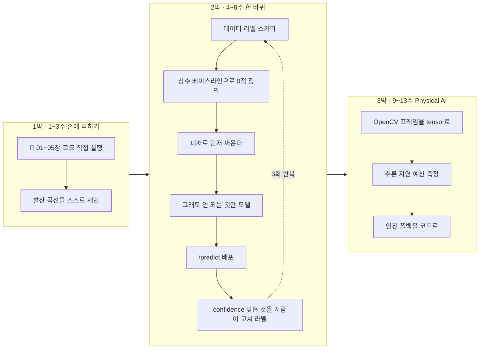

# 07 · 첫 프로젝트와 90일 계획

> 목적: "뭘 하지"를 없애고, **하지 않을 것**을 정해준다.
> 선행: 00~06장. 소요: 20분(읽기) + 90일(실행).

## 7.1 시작 전, 이 목록부터 체크 (안 할 것)

📕책과 Physical AI 요약 문서(`../../../physical-ai-study-summary.md`)가 공통으로 경고하는 함정입니다.
시작하기 전에 이 목록부터 볼게요. 할 일은 그 다음이고요.

| 하지 말 것 | 이유 |
|------------|------|
| ❌ 강화학습부터 | 데이터·시뮬레이션·제어가 전부 필요. 4개 선행이 없는 마지막 단계 |
| ❌ 논문 구현부터 | 학습 곡선이 아니라 좌표 수집 3개월이 됨 |
| ❌ MNIST 3번째 재현 | 이미 아는 것을 다시 하면 이력서에 안 들어갑니다 |
| ❌ "범용 어시스턴트" | 00장/요약문서 공통: 큰 걸 시도하면 아무것도 안 끝남 |
| ❌ 모델 구조 고르기부터 | 01장·05장 실측: 성능은 형태·데이터·평가에서 결정. 구조는 후반부 |
| ❌ 정확도 하나만 보고 | 5.1의 1.3%p 함정을 그대로 답습 |
| ❌ 실제 하드웨어 직행 | 시뮬레이션 검증 없이 = 부품값 + 안전사고 |

한 문장만 적어 두고 넘어갈게요. 90일은 "작은 것을 끝까지 배포한 경험"을 만드는 기간이지, 지식을 모으는
기간이 아닙니다.

## 7.2 90일 계획 (3막)

### 1막 (1~3주): 손에 익히기 — 📕책과 함께

- 📕[PyTorch 도서](../book/README.md) 01~05장을 **읽지 말고 치세요.** 코드는 전부 실행하는 게 목표입니다.
- 이 책 01·03·04·05장의 코드도 직접 실행해서 값까지 확인하면 돼요.
- 결과물: 📕 03장 실험과 같은 학습률 발산 곡선을 스스로 만든 화면. 이게 첫 "이해했다"의 증거입니다.

> 1막의 합격선: `optimizer.zero_grad()`를 빼면 뭐가 망가지는지를 **설명**할 수 있는가.
> (📕02장 2.3 누적 + 이 책 04장 모드 → 합치면 답이 나옵니다.)

### 2막 (4~8주): 데이터 → 평가 → 배포를 한 바퀴

여기가 진짜예요. 하나만 짚고 갈게요. 모델은 이 주기의 한 칸일 뿐입니다.

주제: 실제 데이터 하나를 직접 모아 분류하고 배포하기.
예시 후보는 이미지·텍스트 중 익숙한 쪽으로 하나만 고르세요.

| 후보 | 라벨 출처 | 배포 관점 |
|------|-----------|-----------|
| 중고거래 글 category 분류 | 제목/본문 (스크래핑 or 수기 라벨) | `/predict`에 문장 POST |
| 서비스 에러 로그 자동 분류 | 기존 이슈 라벨 or 수기 | 이미 있는 로깅 파이프라인에 얹힘 |
| 센서 이상 탐지 | 장애 타임스탬프 (극단 불균형!) | 5.1을 실전 체감 |
| 부품 불량 판별 (사진) | 기존 QC 결과 | Physical AI 연결점 |

2막 필수 과제 (순서대로):
1. **데이터 수집 + 라벨링 스키마 설계** (03장). 라벨 정의 문서 1장을 먼저 쓰면 됩니다.
2. **상수 베이스라인 만들기** (05.3). 다수 클래스 예측의 정확도니까요. 여기서 시작점 0을 정의합니다.
3. **피처를 직접 만들어 베이스라인 깨기** (01장 A0!). 모델 없이 피처만으로 어디까지 되는지 보는 단계예요.
4. 피처로 안 되는 부분만 모델로 갑니다 (📕04·06). train/val/test 3분할 + 층화 (03.3).
5. **지표는 5.4 체크리스트 6개로 보고.**
6. `/predict`로 배포합니다 (06장). 응답에 `confidence`·`model_version`을 포함해요.
7. 가장 낮은 확신 요청 20개를 사람이 보고 라벨을 수정 → 그 데이터로 2회차 학습.
   (이 7번이 루프입니다. 1회 도는 사람과 3회 도는 사람의 실력 차가 여기서 납니다.)

> **3번을 건너뛰지 마세요.** 모델 넣기 전에 피처로 싸워보는 경험은 01장 실측(0.8048 → 0.9655 → 0.9975)이
> 가르쳐준 그대로이고, 나중에 "모델로 해결 안 되는 문제"를 식별하는 유일한 눈이 됩니다.

### 3막 (9~13주): Physical AI로 연결

이 저장소 로드맵 Phase 4·5로 넘어가기 위한 다리입니다. 여기서부터는 이 책 범위를 조금 밖으로 나가요.

- OpenCV(`03_ai_vision/opencv/`)로 실제 프레임을 tensor로 바꾸는 변환 파이프라인 작성.
  `cv2.imread`는 `(H,W,C)` BGR, PyTorch는 `(C,H,W)` RGB이므로, `permute` 같은 변환 지점을 확보하는 게 목적입니다 (📕06장 6.1).
- 시뮬레이션 또는 웹캠 입력에서 추론 → 다음 장으로 값 전달. 제어 루프 안의 지연 예산을 직접 재보세요.
  06장 실측(2ms)과 네트워크 지터의 차이를 체감하는 순간, 로드맵이 문서에서 일정으로 바뀝니다.
- 안전 계층: 추론이 틀렸을 때의 fallback을 코드로 구현 (비상정지·속도제한·임계값 미달 시 사람).
  5.1의 "17건 통과"가 로봇에서는 물리적 사건이 됩니다.

<!-- diagrams:inserted -->

90일을 한 장으로 줄이면 이렇습니다. 2막이 본진이고, 1막은 그 준비, 3막은 이 저장소 로드맵으로 넘어가는 다리예요.



## 7.3 포트폴리오로 통하는 형태

"모델 만들었습니다"는 안 읽힙니다. 읽히는 건 결론과 근거예요.

```text
README.md
├── 결론 1줄          : "베이스라인 대비 recall 0.43 → 0.78 (비용 비대칭 지표로 보고)"
├── 하지 않은 것과 이유 : "transformer 대신 logistic + n-gram. 데이터 1.2k건이라 과적합(05.2 실측)"
├── 실패한 시도 2개     : "증거 숫자 함께. 이게 가장 신뢰를 만듭니다"
├── 재현 명령          : `pip install -r requirements.txt && python train.py && python serve.py`
├── 학습 곡수/혼동행렬 그림
└── 배포: /predict 예시 curl + 실제 응답
```

- 하지 않은 것을 쓰는 게 핵심입니다. 선택의 근거가 곧 엔지니어링 능력의 증거거든요.
- 재현이 안 되면 포트폴리오가 아니에요. 02장 표의 `manual_seed`·버전 고정이 여기서 값을 발휘합니다.
- Physical AI 방향이면 영상·GIF 1개가 문서 10페이지보다 강합니다. 시뮬레이션 캡처라도 반드시 넣으세요.

## 7.4 주간 리듬 (권장)

| 요일 | 시간 | 내용 |
|------|------|------|
| 평일 2일 | 각 1시간 | 코딩. **새 개념 읽기 금지, 실행만** |
| 평일 1일 | 30분 | 데이터 정리·라벨 수정 (지루하지만 점수가 여기서 오름) |
| 주말 1일 | 2~3시간 | 한 주치 커밋 + README 업데이트 + 다음 주 정하기 |

90일간 커밋이 40개 이상이면 대부분 성공합니다. 5개면 읽기만 한 것이고요. 커밋 개수만은 아무도 속일 수
없어요.

## 7.5 막히면 어디를 먼저 볼까

막히면 아래에서 증상을 고르세요. 왼쪽을 보고 오른쪽 첫 칸부터 열면 됩니다.

| 증상 | 먼저 볼 곳 |
|------|-----------|
| 학습이 안 됨·loss 정체 | 📕03장(lr·에포크 부족이 절반) → 📕부록 A.6 |
| train은 됨 val이 안 됨 | 이 책 05.2(과적합) → 03.4(누수) → 데이터 양 |
| 검증은 좋음 실제는 나쁨 | 05.3·03.3(스플릿 오염) → 배포 시 전처리 상수 미동반(03.5) |
| 결과가 매번 다름 | 04장(eval/no_grad, seed) |
| 느리다 | 06.3(클라이언트/배치/캐시) — **모델부터 의심하지 마세요** |
| 용어가 안 잡힌다 | 02장 매핑표 → 부록 B |
| 뭘 해야 할지 모르겠다 | 이 장 7.2의 2막 순서를 1번부터 |

## 정리

- 90일의 산출물은 지식이 아니라 **"작은 것을 데이터→평가→배포로 3바퀴 돌린 경험"** 입니다.
- 모델 고르기 전에 **상수 베이스라인과 피처**로 싸우세요. 01장 실측이 그 이유입니다.
- `confidence` 낮은 샘플을 사람이 고쳐 라벨을 갱신하는 루프가 **유일한 실력 엔진**입니다.
- Physical AI 목표라면 3막에서 OpenCV·시뮬레이션·안전 폴백으로 이으세요. 로드맵 Phase 4·5의 진입 조건.

## 직접 해보기

1. 2막의 후보 4개 중 **본인이 접근 가능한 데이터가 있는 것**을 하나 고르고, 오늘 100건만 수집/라벨링하세요.
2. 그 데이터로 **상수 베이스라인 정확도**를 계산해 문서에 적으세요. 여기가 당신의 0점입니다.
3. 90일 뒤 이 문서의 7.3 템플릿을 채운 README를 만들 계획으로, 지금 빈 저장소를 하나 만드세요.

다음: [부록 B](appendix_glossary.md) — 사전·생태계·FAQ
