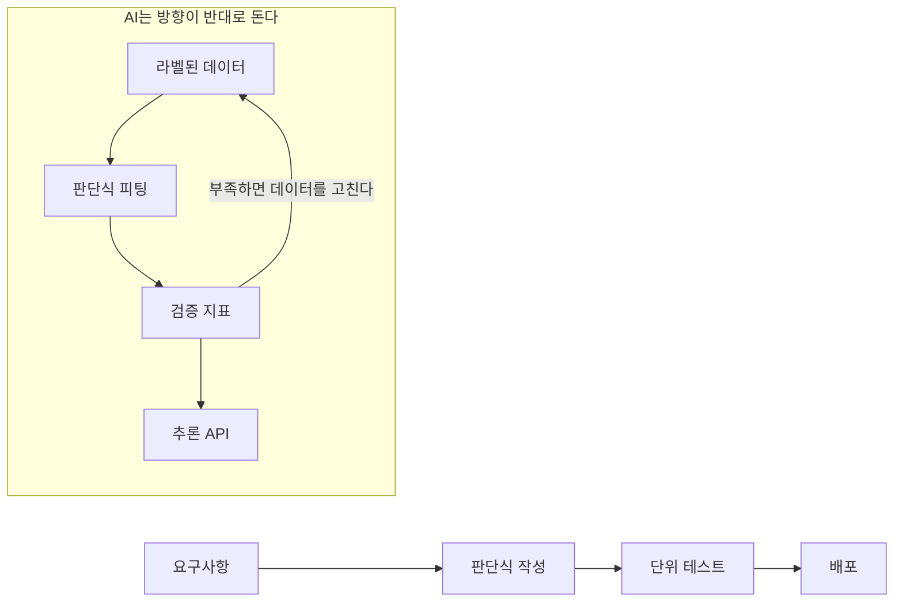

# FE/BE 개발자를 위한 AI 전향 가이드

> **당신은 이미 개발자입니다.** 이 책은 변수·함수·API·배포를 설명하지 않습니다.
> 대신 **코드 짜는 방식의 직관이 AI에서 어디부터 꺾이는지**를, 실제로 실행한 숫자로 보여줍니다.

숫자를 읽다가 "이 정도는 나도 알겠는데?" 싶으실 거예요. 그리고 아래에서 그 직관이 조용히 꺾이죠.
괜찮습니다. 다 그렇게 시작합니다.

- **대상**: 프론트엔드나 백엔드 실무를 1년 이상 하셨고, 딥러닝은 "그때그때 따라쳐본 수준"을 넘지 않는 분.
- **전제 아님**: 미분이나 확률론을 미리 알아야 할 필요는 없어요. 필요한 순간에 3줄로 설명해 드릴게요.
- **검증 환경**: PyTorch 2.8.0+cpu, scikit-learn, numpy. GPU도 `pandas`도 `fastapi`도 없이 전부 돌아갑니다.
- **신뢰 원칙**: 이 책의 모든 출력과 수치는 이 머신에서 실행한 결과입니다. 예로 만든 숫자는 하나도 없어요.

---

## 이 책의 주장 한 줄

> 일반 개발은 **"판단식을 작성하는 일"** 이고, AI는 **"판단식을 데이터에서 찾아오게 하는 일"** 이다.
> 그래서 AI의 코드 30줄 중 25줄은 모델이 아니라 **데이터·평가·서빙**이다.

이 전환만 이해하면 나머지는 그냥 평범한 기술 스택이에요. 라이브러리 API도, 논문도, 용어도 마찬가집니다.

반면에 "뭔가 안 잡힌다" 싶은 지점의 90%는, 이 한 문장이 아직 안 낀 상태입니다.

---

## 목차

| 장 | 다루는 갭 | 근거 실험 |
|----|-----------|-----------|
| [00](00_preface.md) | 무엇이 정말 다른가 — 6행 비교표 | — |
| [01](01_paradigm.md) | 규칙을 **쓰는** 것과 **배우는** 것 | 원형 경계 분류: 손글씨 규칙 80.5% / 형태 맞힌 규칙 96.6% / 피팅 99.7% |
| [02](02_skill_mapping.md) | 아는 것의 재사용 — FE/BE 용어 ↔ AI | — |
| [03](03_data.md) | 데이터가 곧 로직이다 — 라벨·스플릿·누수 | 타깃 누수: 정상 0.83 vs **누수 1.00** |
| [04](04_model.md) | 모델 = **상태가 있는** 함수 | Dropout: train() 출력 두 번 다름, eval() 동일 |
| [05](05_eval.md) | 지표의 함정 — 직관이 꺾이는 지점 | 불균형: accuracy 0.963인데 **모수 재현율 0.433** |
| [06](06_serving.md) | BE 경험이 그대로 먹히는 곳 | pure 추론 0.022ms vs 왕복 1.75ms vs 클라이언트 재생성 328.0ms |
| [07](07_first_project.md) | 첫 프로젝트와 90일 계획 | — |
| [부록 B](appendix_glossary.md) | 용어 대조표 · 생태계 · FAQ | — |



---

## 읽는 순서

- **시간이 1시간뿐이면** → [01장](01_paradigm.md)과 [05장](05_eval.md)만 보세요. 이 책의 핵심 결론 2개가 그 두 장에 있습니다.
- **이론보다 먼저 손이 움직이길 원하면** → [06장](06_serving.md)부터예요. 이미 익숙한 "API 올리기"로 들어가면 모델을 부수적으로 만나게 됩니다.
- **용어가 계속 꼬이면** → [02장](02_skill_mapping.md)과 [부록 B](appendix_glossary.md)를 사전처럼 끼워 읽으세요.

어디로 들어와도 상관없습니다. 다만 실험이 들어 있는 장은 건너뛰지 마세요. 이 책이 걸고 싶은 판정이
거기 있습니다.

> 선행지식: PyTorch 문법이 필요하면 같은 저장소의 📕[PyTorch — Tensor에서 이미지 분류까지](../book/README.md)를 먼저 보되,
> 이 책은 그 코드를 재설명하지 않습니다. **관점만** 바꿉니다.

## 코드 실행

코드는 아래 파일들에 있어요.

```text
switch/code/
├── ch01_paradigm.py     # 01장 손글씨 규칙 vs 피팅된 경계
├── ch04_state.py        # 04장 train()/eval() 비결정성
├── ch05_traps.py        # 05장 정확도 역설·과적합·누수
└── ch06_serving.py      # 06장 stdlib HTTP 추론 API + 지연 측정
```

```bash
cd switch/code && python ch01_paradigm.py
```

---

*시작 → [00. 전향자를 위한 서문](00_preface.md)*
